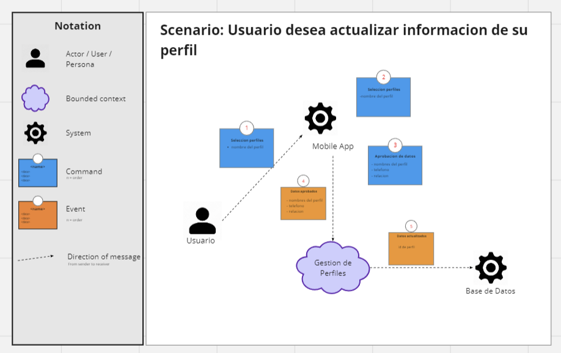
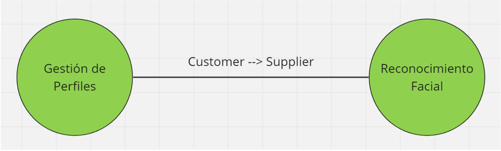
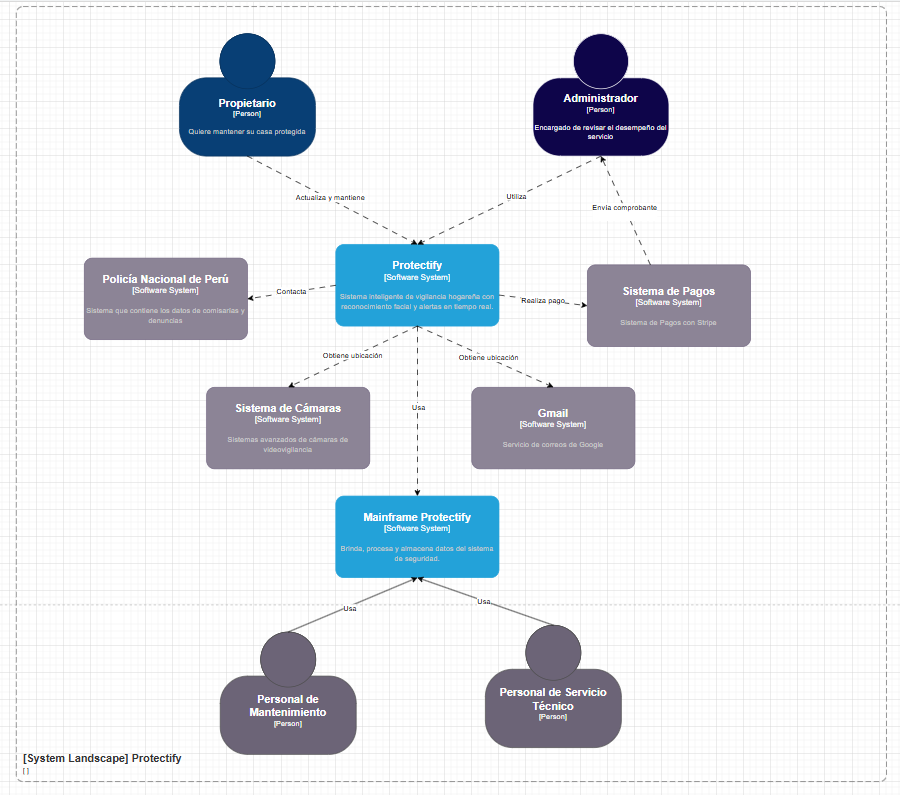

  

  <h1>Universidad Peruana de Ciencias Aplicadas</h1>
  
<strong>Carrera:</strong> Ingenieria de Software

  
<strong>Ciclo:</strong> 2025 - 1

  
<strong>Curso:</strong> Desarrollo de Soluciones IOT

  
<strong>Sección:</strong> 15260

  
<strong>Profesor:</strong> David Carlos Vera

  
<strong>"Informe de Trabajo Final"</strong>

  
<strong>Startup:</strong> SafeTech Solutions

  
<strong>Producto:</strong> Protectify

<table align="center">
  <tr>
    <th>Integrantes</th>
    <th>Código</th>
  </tr>
  <tr>
    <td>Adrianzen Flores, Carlos Arturo</td>
    <td>U202215705</td>
  </tr>
  <tr>
    <td>Dam Rubianes, Frida Sofia</td>
    <td>U202218352</td>
  </tr>
  <tr>
    <td>Matos Fernandez, Christian Andre</td>
    <td>U202214162</td>
  </tr>
  <tr>
    <td>Ortiz Fajardo, Tomás</td>
    <td>U201910146</td>
  </tr>
  <tr>
    <td>Ramos Ramirez, Renzo Manuel</td>
    <td>U202113745</td>
  </tr>
</table>

<b>Abril 2025</b>

# Registro de Versiones

<table>
  <thead>
    <tr>
        <th>Versión</th>
        <th>Fecha</th>
        <th>Autor</th>
        <th>Descripción de modificación</th>
    </tr>
  </thead>
  <tbody>
    <tr>
      <td><strong>1.0</strong></td>
      <td>18 de abril de 2025</td>
      <td>
        <ul>
          <li>Dam Rubianes, Frida Sofia</li>
        </ul>
      </td>
      <td>
        Capítulo I: Introducción
      </td>
    </tr>
    <tr>
      <td><strong>2.0</strong></td>
      <td>19 de abril de 2025</td>
      <td>
        <ul>
          <li>Adrianzen Flores, Carlos Arturo</li>
          <li>Ortiz Fajardo, Tomás</li>
        </ul>
      </td>
      <td>
        Capítulo II: Requirements Elicitation & Analysis
      </td>
    </tr>
    <tr>
      <td><strong>3.0</strong></td>
      <td>20 de abril de 2025</td>
      <td>
        <ul>
          <li>Matos Fernandez, Christian Andre</li>
        </ul>
      </td>
      <td>
        Capítulo III: Requirements Specification
      </td>
    </tr>
    <tr>
      <td><strong>4.0</strong></td>
      <td>26 de abril de 2025</td>
      <td>
        <ul>
          <li>Ramos Ramirez, Renzo Manuel</li>
          <li>Matos Fernandez, Christian Andre</li>
        </ul>
      </td>
      <td>
        Capítulo IV: Solution Software Design
      </td>
    </tr>
    <tr>
      <td><strong>5.0</strong></td>
      <td>17 de mayo de 2025</td>
      <td>
        <ul>
          <li>Ramos Ramirez, Renzo Manuel</li>
          <li>Matos Fernandez, Christian Andre</li>
          <li>Adrianzen Flores, Carlos Arturo</li>
          <li>Ortiz Fajardo, Tomás</li>
          <li>Dam Rubianes, Frida Sofia</li>
        </ul>
      </td>
      <td>
        <ul>
          <li>Capítulo V: Solution UI/UX Design</li>
          <li>Capítulo VI: Product Implementation, Validation & Deployment</li>
        </ul>
      </td>
    </tr>
    <tr>
      <td><strong>6.0</strong></td>
      <td>18 de mayo de 2025</td>
      <td>
        <ul>
          <li>Matos Fernandez, Christian Andre</li>
        </ul>
      </td>
      <td>
        <ul>
          <li>Correciones</li>
        </ul>
      </td>
    </tr>
    
  </tbody>
</table>

**Link del Repositorio**: [Protectify](https://github.com/UPC-Iot)

# Project Report Collaboration Insights

<table>
  <thead>
    <tr>
      <th>Entregables</th>
      <th>Evidencias</th>
    </tr>
  </thead>
  <tbody>
    <tr>
      <td>
        <strong>TB1:</strong> 
        • Dam Rubianes, Frida Sofía – Capítulo I: Introducción 
        • Adrianzen Flores, Carlos Arturo – Capítulo II: Requirements Elicitation & Analysis 
        • Ortiz Fajardo, Tomás – Capítulo II: Requirements Elicitation & Analysis 
        • Matos Fernandez, Christian Andre – Capítulo III: Requirements Specification 
        • Matos Fernandez, Christian Andre – Capítulo IV: Solution Software Design 
        • Ramos Ramirez, Renzo Manuel – Capítulo IV: Solution Software Design
      </td>
      <td style="text-align:center;">
          
        
      </td>
    </tr>
    <tr>
      <td>
        <strong>TP1:</strong> 
        • Dam Rubianes, Frida Sofía – Capítulo V: Solution UI/UX Design 
        • Adrianzen Flores, Carlos Arturo – Capítulo V: Solution UI/UX Design 
        • Ortiz Fajardo, Tomás – Capítulo V: Solution UI/UX Design 
        • Matos Fernandez, Christian Andre – Capítulo V: UI/UX Design 
        • Matos Fernandez, Christian Andre – Capítulo VI: Implementation, Validation & Deployment 
        • Ramos Ramirez, Renzo Manuel – Capítulo V: Solution UI/UX Design
      </td>
      <td style="text-align:center;">
          
        
      </td>
    </tr>
  </tbody>
</table>

# Tabla de Contenido

[Registro de Versiones](#registro-de-versiones)

[Project Report Collaboration Insights](#project-report-collaboration-insights)

[Tabla de contenidos](#tabla-de-contenidos)

[Student Outcome](#student-outcome)

[Capítulo I: Introducción](#capítulo-i-introducción)

- [1.1. Startup Profile](#11-startup-profile)
  - [1.1.1. Descripción de la Startup](#111-descripción-de-la-startup)
  - [1.1.2. Perfiles de integrantes del equipo](#112-perfiles-de-integrantes-del-equipo)
- [1.2. Solution Profile](#12-solution-profile)
  - [1.2.1. Antecedentes y problemática](#121-antecedentes-y-problemática)
  - [1.2.2. Lean UX Process](#122-lean-ux-process)
    - [1.2.2.1. Lean UX Problem Statements](#1221-lean-ux-problem-statements)
    - [1.2.2.2. Lean UX Assumptions](#1222-lean-ux-assumptions)
    - [1.2.2.3. Lean UX Hypothesis Statements](#1223-lean-ux-hypothesis-statements)
    - [1.2.2.4. Lean UX Canvas](#1224-lean-ux-canvas)
- [1.3. Segmentos objetivo](#13-segmentos-objetivo)

[Capítulo II: Requirements Elicitation & Analysis](#capítulo-ii-requirements-elicitation--analysis)

- [2.1. Competidores](#21-competidores)
  - [2.1.1. Análisis competitivo](#211-análisis-competitivo)
  - [2.1.2. Estrategias y tácticas frente a competidores](#212-estrategias-y-tácticas-frente-a-competidores)
- [2.2. Entrevistas](#22-entrevistas)
  - [2.2.1. Diseño de entrevistas](#221-diseño-de-entrevistas)
  - [2.2.2. Registro de entrevistas](#222-registro-de-entrevistas)
  - [2.2.3. Análisis de entrevistas](#223-análisis-de-entrevistas)
- [2.3. Needfinding](#23-needfinding)
  - [2.3.1. User Personas](#231-user-personas)
  - [2.3.2. User Task Matrix](#232-user-task-matrix)
  - [2.3.3. User Journey Mapping](#233-user-journey-mapping)
  - [2.3.4. Empathy Mapping](#234-empathy-mapping)
  - [2.3.5. As-is Scenario Mapping](#235-as-is-scenario-mapping)
- [2.4. Ubiquitous Language](#24-ubiquitous-language)

[Capítulo III: Requirements Specification](#capítulo-iii-requirements-specification)

- [3.1. To-Be Scenario Mapping](#31-to-be-scenario-mapping)
- [3.2. User Stories](#32-user-stories)
- [3.3. Impact Mapping](#33-impact-mapping)
- [3.4. Product Backlog](#34-product-backlog)

[Capítulo IV: Solution Software Design](#capítulo-iv-solution-software-design)

- [4.1. Strategic-Level Domain-Driven Design](#41-strategic-level-domain-driven-design)
  - [4.1.1. EventStorming](#411-eventstorming)
    - [4.1.1.1. Candidate Context Discovery](#4111-candidate-context-discovery)
    - [4.1.1.2. Domain Message Flows Modeling](#4112-domain-message-flows-modeling)
    - [4.1.1.3. Bounded Context Canvases](#4113-bounded-context-canvases)
  - [4.1.2. Context Mapping](#412-context-mapping)
  - [4.1.3. Software Architecture](#413-software-architecture)
    - [4.1.3.1. System Landscape Diagram](#4131-system-landscape-diagram)
    - [4.1.3.2. Context Level Diagrams](#4132-context-level-diagrams)
    - [4.1.3.3. Container Level Diagrams](#4133-container-level-diagrams)
    - [4.1.3.4. Deployment Diagrams](#4134-deployment-diagrams)
- [4.2. Tactical-Level Domain-Driven Design](#42-tactical-level-domain-driven-design)
  - [4.2.1. Bounded Context: Perfíl](#421-bounded-context-perfíl)
    - [4.2.1.1. Domain Layer](#4211-domain-layer)
    - [4.2.1.2. Interface Layer](#4212-interface-layer)
    - [4.2.1.3. Application Layer](#4213-application-layer)
    - [4.2.1.4. Infrastructure Layer](#4214-infrastructure-layer)
    - [4.2.1.5. Component Level Diagrams](#4215-component-level-diagrams)
    - [4.2.1.6. Code Level Diagrams](#4216-code-level-diagrams)
      - [4.2.1.6.1. Class Diagrams](#42161-class-diagrams)
      - [4.2.1.6.2. Database Design Diagram](#42162-database-design-diagram)
  - [4.2.2. Bounded Context: Reconocimiento](#422-bounded-context-reconocimiento)
    - [4.2.2.1. Domain Layer](#4221-domain-layer)
    - [4.2.2.2. Interface Layer](#4222-interface-layer)
    - [4.2.2.3. Application Layer](#4223-application-layer)
    - [4.2.2.4. Infrastructure Layer](#4224-infrastructure-layer)
    - [4.2.2.5. Component Level Diagrams](#4225-component-level-diagrams)
    - [4.2.2.6. Code Level Diagrams](#4226-code-level-diagrams)
      - [4.2.2.6.1. Class Diagrams](#42261-class-diagrams)
      - [4.2.2.6.2. Database Design Diagram](#42262-database-design-diagram)

[Capítulo V: Solution UI/UX Design](#capítulo-v-solution-uiux-design)

- [5.1. Style Guidelines](#51-style-guidelines)
  - [5.1.1. General Style Guidelines](#511-general-style-guidelines)
  - [5.1.2. Web, Mobile and IoT Style Guidelines](#512-web-mobile-and-iot-style-guidelines)
- [5.2. Information Architecture](#52-information-architecture)
  - [5.2.1. Organization Systems](#521-organization-systems)
  - [5.2.2. Labeling Systems](#522-labeling-systems)
  - [5.2.3. SEO Tags and Meta Tags](#523-seo-tags-and-meta-tags)
  - [5.2.4. Searching Systems](#524-searching-systems)
  - [5.2.5. Navigation Systems](#525-navigation-systems)
- [5.3. Landing Page UI Design](#53-landing-page-ui-design)
  - [5.3.1. Landing Page Wireframe](#531-landing-page-wireframe)
  - [5.3.2. Landing Page Mock-up](#532-landing-page-mock-up)
- [5.4. Applications UX/UI Design](#54-applications-uxui-design)
  - [5.4.1. Applications Wireframes](#541-applications-wireframes)
  - [5.4.2. Applications Wireflow Diagrams](#542-applications-wireflow-diagrams)
  - [5.4.2. Applications Mock-ups](#542-applications-mock-ups)
  - [5.4.3. Applications User Flow Diagrams](#543-applications-user-flow-diagrams)
- [5.5. Applications Prototyping](#55-applications-prototyping)

[Capítulo VI: Product Implementation, Validation & Deployment](#capítulo-vi-product-implementation-validation--deployment)

- [6.1. Software Configuration Management](#61-software-configuration-management)
  - [6.1.1. Software Development Environment Configuration](#611-software-development-environment-configuration)
  - [6.1.2. Source Code Management](#612-source-code-management)
  - [6.1.3. Source Code Style Guide & Conventions](#613-source-code-style-guide--conventions)
  - [6.1.4. Software Deployment Configuration](#614-software-deployment-configuration)
- [6.2. Landing Page, Services & Applications Implementation](#62-landing-page-services--applications-implementation)
  - [6.2.1. Sprint 1](#621-sprint-1)
    - [6.2.1.1. Sprint Planning n](#6211-sprint-planning-n)
    - [6.2.1.2. Aspect Leaders and Collaborators](#6212-aspect-leaders-and-collaborators)
    - [6.2.1.3. Sprint Backlog n](#6213-sprint-backlog-n)
    - [6.2.1.4. Development Evidence for Sprint Review](#6214-development-evidence-for-sprint-review)
    - [6.2.1.5. Testing Suite Evidence for Sprint Review](#6215-testing-suite-evidence-for-sprint-review)
    - [6.2.1.6. Execution Evidence for Sprint Review](#6216-execution-evidence-for-sprint-review)
    - [6.2.1.7. Services Documentation Evidence for Sprint Review](#6217-services-documentation-evidence-for-sprint-review)
    - [6.2.1.8. Software Deployment Evidence for Sprint Review](#6218-software-deployment-evidence-for-sprint-review)
    - [6.2.1.9. Team Collaboration Insights during Sprint](#6219-team-collaboration-insights-during-sprint)

# Student Outcome

ABET – EAC - Student Outcome 5: La capacidad de funcionar efectivamente en un
equipo cuyos miembros juntos proporcionan liderazgo, crean un entorno de
colaboración e inclusivo, establecen objetivos, planifican tareas y cumplen objetivos.

<table>
  <thead>
    <tr>
      <th>Criterio específico</th>
      <th>Acciones realizadas</th>
      <th>Conclusiones</th>
    </tr> 
  </thead>
  <tbody>
    <tr>
      <td><strong>Trabaja en equipo para proporcionar liderazgo en forma conjunta</strong></td>
      <td>
        <strong>Renzo Manuel Ramos Ramirez</strong> <strong>TB1:</strong>En esta entrega tuve que reunirme con el grupo para acordar los puntos a tratar. Tuve que realizar el event storming para comprender la lógica del negocio y así poder explicarlo de forma gráfica los procesos que conlleva nuestro proyecto. Además, tuve que separar los procesos y los flujos para que tuvieran un orden y así sea entendible  
        <strong>Christian Andre Matos Fernandez</strong> <strong>TB1:</strong>Durante el desarrollo del proyecto, contribuí activamente al trabajo en equipo brindando liderazgo conjunto. Asumí la responsabilidad de tareas clave como el To-be Scenario Mapping, User Stories, Impact Mapping y la elaboración del Product Backlog, promoviendo una visión compartida del producto. Además, lideré la definición del diseño a nivel táctico mediante el Tactical-Level Domain-Driven Design, estructurando los Bounded Contexts y desarrollando diagramas a nivel de componentes, clases y base de datos, fomentando así una colaboración técnica efectiva entre los integrantes.  
        <strong>Frida Sofia Dam Rubianes</strong> <strong>TB1: Durante esta entrega, participé activamente en las reuniones de coordinación con el equipo, proponiendo ideas y escuchando las opiniones de todos para lograr una mejor organización del trabajo. Además, fomenté la colaboración al apoyar a mis compañeros en la resolución de dudas y asegurarme de que todos estuviéramos alineados con los objetivos del proyecto, promoviendo así un liderazgo compartido y un ambiente de trabajo participativo.</strong>  
        <strong>Carlos Arturo Adrianzen Flores</strong> <strong>TB1: En esta entrega, me encargué de realizar el análisis competitivo, evaluando a los principales competidores en el mercado para entender sus fortalezas y debilidades. A partir de ahí, pude identificar las oportunidades para mejorar nuestro producto y diferenciarlo de las opciones existentes. Además, llevé a cabo las entrevistas con los usuarios objetivo, recopilando información clave sobre sus necesidades y expectativas. Posteriormente, realicé un análisis detallado de las entrevistas, extrayendo patrones y características comunes que nos ayudaron a comprender mejor los arquetipos de usuario y los puntos críticos que debíamos abordar en el diseño del proyecto.</strong>  
        <strong>Tomás Ortiz Fajardo</strong> <strong>TB1:</strong>Para este proyecto, participe con mi equipo de las reuniones y realice las actividades que quedamos a realizar. Pude hacer el As-Is Scenario Mapping, además del Empathy Mapping, User Persona, User Task Matrix, entre otras partes del capítulo 2. Por otro lado, como ya mencioné, pude conversar con mis compañeros en las reuniones para conocer sus opiniones respecto al tema elegido y saber que partes nos podríamos dividir entre todos, siempre teniendo en cuenta sus opiniones y sabiendo sus preferencias y el tiempo que tenían para realizar lo necesario para esta entrega. 
      </td>
      <td>TB1: A lo largo del proyecto, el equipo ejerció un liderazgo compartido, donde cada integrante asumió responsabilidades clave y contribuyó activamente a la toma de decisiones. El trabajo en equipo fue constante, basado en la confianza y el respeto mutuo, lo que permitió coordinar esfuerzos de manera equilibrada y mantener el rumbo del proyecto con una visión común.</td>
    </tr>
    <tr>
      <td><strong>Crea un entorno colaborativo e inclusivo, establece metas, planifica tareas y cumple objetivos</strong></td>
      <td>
        <strong>Renzo Manuel Ramos Ramirez</strong> <strong>TB1:</strong>En esta entrega me comuniqué con mis compañeros para poder trabajar diversos puntos del proyecto. Tuve que diseñar la arquitectura de la aplicación comprendiendo los Bounded Context y cómo interactúan entre si. Empleé el diagrama C4 para especificar cada parte del sistema para que los demás integrantes conocieran del proceso y las tecnologías del mismo sistema.  
        <strong>Christian Andre Matos Fernandez</strong> <strong>TB1: </strong>Durante el proyecto, fomenté un entorno colaborativo e inclusivo al promover una comunicación constante entre los miembros del equipo. Me enfoqué en establecer metas claras y compartidas, y planifiqué las tareas de forma estructurada mediante herramientas como el Product Backlog e Impact Mapping. Esto permitió organizar el trabajo de forma efectiva, facilitando el cumplimiento de objetivos dentro de los plazos establecidos, y asegurando que cada integrante tuviera claridad sobre su rol y responsabilidades.  
        <strong>Frida Sofia Dam Rubianes</strong> <strong>TB1: Durante esta entrega, participé activamente en la creación de un entorno colaborativo e inclusivo, manteniendo una comunicación constante con mis compañeros para coordinar avances y resolver dudas. Contribuí en la planificación de tareas distribuyendo actividades de manera equitativa y asegurándome de que todos tuviéramos metas claras para cumplir con los plazos establecidos. Además, estuve atento al progreso del equipo, apoyando en lo necesario para garantizar que los objetivos del proyecto se cumplieran de forma ordenada y efectiva.</strong>  
        <strong>Carlos Arturo Adrianzen Flores</strong> <strong>TB1: Durante esta entrega, trabajé activamente para crear un entorno colaborativo e inclusivo dentro del equipo. Me comuniqué de manera constante con mis compañeros para coordinar el análisis competitivo y las entrevistas, asegurando que todos estuviéramos alineados en la comprensión de los competidores y sus estrategias. Además, me encargué de registrar y analizar las entrevistas, extrayendo datos clave para la construcción de los arquetipos de usuario. Utilicé estos resultados para establecer metas claras y compartidas, lo que permitió planificar las tareas de manera estructurada. Como resultado, pudimos cumplir los objetivos establecidos de forma efectiva, garantizando una base sólida para las siguientes etapas del proyecto.</strong>  
        <strong>Tomás Ortiz Fajardo</strong> <strong>TB1:</strong>Para este proyecto, me comunique activamente con mis compañeros, para siempre estar en la misma página y poder avanzar el trabajo de acuerdo al cronograma del curso. Además me ordenaba para que pueda completar con las actividades que me tocaba realizar del trabajo, y poder contribuir en cualquier reunión, siempre aportando ideas y comentarios para la mejora de este trabajo. 
      </td>
      <td>TB1: El equipo fomentó un entorno colaborativo e inclusivo, donde todas las ideas fueron valoradas y consideradas en el desarrollo del proyecto. Se establecieron metas claras desde el inicio, se organizaron tareas de forma estructurada y se trabajó con disciplina para cumplir los objetivos planteados. Esta organización y compromiso grupal permitió avanzar de forma eficiente y cohesionada.</td>
    </tr>
  </tbody>
</table>

# Capítulo I: Introducción

## 1.1. Startup Profile

### 1.1.1. Descripción de la Startup

**Protectify** es una empresa emergente que busca enfrentar los desafíos sociales relacionados con la inseguridad, mediante el uso de tecnologías innovadoras adaptadas al mercado peruano. La startup está conformada por estudiantes de la Facultad de Ingeniería y Ciencias de la Universidad Peruana de Ciencias Aplicadas (UPC). Su enfoque principal es el desarrollo de sistemas de vigilancia inteligentes para hogares, ofreciendo una experiencia de seguridad integral y tranquilidad a sus usuarios.

#### Misión

La misión de SafeTech Solutionses proporcionar protección y tranquilidad a las familias peruanas, asegurando la seguridad en sus hogares mediante soluciones tecnológicas de vigilancia avanzadas.

#### Visión

La visión de SafeTech Solutionses convertirse en un referente latinoamericano en soluciones de vigilancia, contribuyendo a mejorar la calidad de vida de las personas. Anhelamos un futuro donde cada familia pueda sentirse segura dentro de su hogar.

#### Valores

- **Seguridad:** Representa el eje central de nuestra labor. Nos dedicamos a ofrecer herramientas eficaces para el bienestar cotidiano de nuestros clientes.
- **Innovación:** Estamos en constante evolución tecnológica para ofrecer soluciones que respondan cada vez mejor a las necesidades del usuario.
- **Compromiso con el usuario:** Colocamos al usuario en el centro de nuestras decisiones, trabajando para superar sus expectativas y mejorar su experiencia.

### 1.1.2. Perfiles de integrantes del equipo

| Integrante                                                                                                                                                                                                                                                                                                                                                                                                                                                                                                                                                                                                                  | Foto                                                                                      |
| --------------------------------------------------------------------------------------------------------------------------------------------------------------------------------------------------------------------------------------------------------------------------------------------------------------------------------------------------------------------------------------------------------------------------------------------------------------------------------------------------------------------------------------------------------------------------------------------------------------------------- | ----------------------------------------------------------------------------------------- |
| **Frida Sofia Dam Rubianes (U202218352)** Soy Frida Dam, estoy en el 7mo ciclo de la carrera de Ingeniería de Software. Me apasiona el trabajo en equipo y encontrar soluciones mediante la tecnología. Aportaré en el trabajo con mis conocimientos adquiridos en cursos previos sobre IoT.                                                                                                                                                                                                                                                                                                                             |  |
| **Christian Andre Matos Fernandez (U202214162)** Mi nombre es Christian Matos y actualmente curso el séptimo ciclo de la carrera de Ingeniería de Software. Tengo experiencia en desarrollo web y móvil, y a lo largo de mi formación he trabajado con una variedad de lenguajes y tecnologías que me han permitido adaptarme a diferentes tipos de proyectos. Utilizo Python y C++ para resolver problemas algorítmicos y de lógica, Java para aplicaciones estructuradas, JavaScript y TypeScript junto con Vue para el desarrollo frontend dinámico, .NET para servicios backend, y Kotlin para aplicaciones móviles. |                                                             |
| **Tomás Ortiz Fajardo (U201910146)** Mi nombre es Tomás Ortiz Fajardo y me encuentro cursando el octavo ciclo de la carrera de Ingeniería de Software. Desde hace varios años he empezado a agarrar experiencia en diversos lenguajes de programación como Python, Javascript, Swift, entre otros. Para este trabajo aportaré con todos los conocimientos que tenga para que podamos sobresalir en el curso.                                                                                                                                                                                                             |                                                                 |
| **Renzo Manuel Ramos Ramirez (U202113745)** Mi nombre es Renzo Ramos, soy un estudiante de la carrera Ingeniería de Software. Me interesa mucho el desarrollo de aplicaciones tanto web como móviles. También valoro mucho el trabajo en equipo y siempre trato de mantener una buena comunicación con mis compañeros. Siempre busco mejorar como desarrollador con cada proyecto.                                                                                                                                                                                                                                       |                                                             |
| **Carlos Arturo Adrianzén Flores (U202215705)** Soy estudiante de la carrera de Ingenieria de Software, me apasiona el desarrollo tecnologico, a lo largo de mi carreara he logrado ver distintos lenguajes de programación como c ++, python y java. Espero poder aprender mas de IOT durante el desarrollo de este proyecto.                                                                                                                                                                                                                                                                                           |                                                               |

## 1.2. Solution Profile

Nuestra propuesta es Protectify, un sistema de seguridad doméstica con inteligencia artificial. Usa cámaras de alta resolución para monitorear el hogar y, al detectar movimiento, emplea reconocimiento facial para identificar residentes y visitantes. Si detecta una persona desconocida, envía una alerta al usuario vía app, quien podrá confirmar si es un visitante o un posible intruso. Además, permite crear perfiles personalizados para visitantes frecuentes, facilitando la identificación.

### 1.2.1. Antecedentes y problemática

En el contexto actual de creciente urbanización y digitalización, la vigilancia se ha vuelto esencial para garantizar la seguridad ciudadana. Las cámaras de seguridad han evolucionado notablemente, pasando de simples grabaciones a sistemas inteligentes capaces de actuar en tiempo real. Este desarrollo representa una oportunidad importante para incrementar la seguridad en ciudades como Lima, la capital peruana.

Lima enfrenta serios desafíos en materia de seguridad. Aunque se han adoptado estrategias convencionales como el patrullaje policial, persisten deficiencias en la prevención y respuesta efectiva frente a delitos. Según el INEI, en 2020 se registraron 189,656 denuncias por delitos contra el patrimonio. Aunque estas cifras bajaron a 50,776 en el primer semestre de 2021, los robos en viviendas siguen siendo comunes. Datos de Verisure revelan un incremento del 82% en robos a hogares y negocios en 2022 en ciudades como Lima, Callao, Trujillo, Chiclayo, Piura, Cusco, Ica y Arequipa.

Para analizar esta problemática de manera detallada, utilizamos la metodología **5Ws & 2Hs**:

#### What (¿Qué?)

- **Problema:** El incremento de robos en viviendas representa una de las mayores preocupaciones en el país.
- **Relación con la solución:** Protectify permite monitorear el hogar a distancia y reaccionar ante la presencia de intrusos no identificados.

#### When (¿Cuándo?)

- El problema ocurre cuando las viviendas no cuentan con sistemas de seguridad, quedando vulnerables durante la ausencia de sus dueños.

#### Where (¿Dónde?)

- **Uso del producto:** Desde cualquier ubicación, mediante la app Protectify.
- **Público objetivo:** Personas en zonas urbanas de Lima sin sistemas de seguridad instalados.
- **Ubicación del problema:** Principalmente en zonas con alto índice de delincuencia en Lima.

#### Who (¿Quiénes?)

- **Involucrados:** Ladrones, víctimas (dueños y habitantes de las casas), autoridades y vecinos.
- **Afectados:** Personas que pasan muchas horas fuera de casa y no cuentan con vigilancia.
- **Usuarios potenciales:** Personas que ya fueron víctimas, están fuera por viajes, o buscan proteger su hogar.

#### Why (¿Por qué?)

- La inseguridad y la alta tasa de robos motivan la creación de Protectify, con el objetivo de reducir incidentes y ayudar a capturar delincuentes.

#### How (¿Cómo?)

- **Condiciones de uso:** Usuarios que suelen dejar su vivienda desatendida.
- **Medios de difusión:** Publicidad en TikTok, Instagram y Facebook.
- **Acceso al contenido:** A través de la aplicación Protectify, donde se puede revisar cámaras, recibir alertas y activar el mecanismo de defensa.
- **Motivación para la compra:** El crecimiento continuo de la criminalidad en Lima.

#### How much (¿Cuánto?)

- **Presupuesto estimado:** S/. 1000 para el desarrollo e implementación del sistema.

### 1.2.2. Lean UX Process

#### 1.2.2.1. Lean UX Problem Statements

**Problem Statement 1:**
Actualmente, hemos notado que la tasa de criminalidad en el Perú es elevada, por lo tanto nuestra solución desea mejorar la tranquilidad y seguridad ciudadana.
Hemos podido identificar que un factor determinante que pone en riesgo la seguridad y economía de los ciudadanos, son los delitos que ocurren en nuestro país, tales como los robos a domicilios, que cuando se producen, los ladrones se llevan dinero u objetos de valor que luego las personas tienen que volver a adquirir.
¿Cómo facilitar nuevas herramientas para luchar contra la delincuencia?

**Problem Statement 2:**
Nuestro entorno demanda información importante para reducir la cantidad de robos a domicilios en Lima. Por medio de esta información, nuestros clientes podrán tener una mayor seguridad y protección dentro de sus domicilios.
Hemos identificado un factor crítico que afecta a la integridad física y mental de la población, el cual se manifiesta en la inseguridad al momento en el que las personas salen de sus viviendas, debido a que al no saber si su domicilio estará lo suficientemente protegida para evitar un robo, les afecta mental y emocionalmente.
¿Cómo podemos mejorar la seguridad de las viviendas de los ciudadanos que residen en Lima?

**Problem Statement 3:**
En la actualidad, podemos ver que cuando un ladrón ingresa a una vivienda en la que no están los dueños, y esta no cuenta con alguna seguridad, los propietarios no pueden hacer nada para evitar el robo, por lo que nuestro producto quiere ofrecer una medida de defensa para frustrar estos intentos de robo.
Logramos identificar que un factor crítico que pone en riesgo la seguridad de los domicilios, es la falta de una acción defensiva en caso un ladrón logre ingresar.
¿Cómo implementar una herramienta en la que se pueda frustrar el robo sin que algún propietario se encuentre presente?

---

#### 1.2.2.2. Lean UX Assumptions

#### Business Outcomes

- Nuestros usuarios necesitan sentirse seguros cuando no están en sus casas.
- Estas necesidades se pueden resolver con un sistema de videovigilancia con IA que alerte al dueño si alguien entra al domicilio.
- Nuestros clientes iniciales son personas entre 20 y 60 años que viven en zonas urbanas de Lima.
- El valor #1 que un cliente quiere de nuestro servicio es poder usar el sistema en todo momento y contar con medidas de autodefensa efectivas.
- El cliente también puede obtener beneficios como el historial de personas que ingresaron, su tiempo dentro y grabaciones en alta definición.
- Vamos a adquirir la mayoría de nuestros clientes a través de campañas en redes sociales y recomendaciones.
- Haremos dinero a través de la venta del producto y el alquiler de servicios.
- Nuestras competencias principales en el mercado son Verisure y Prosegur.
- Los venceremos debido a ventajas como cámaras de alta resolución, mecanismos de autodefensa y registros detallados de ingreso.
- El mayor riesgo que puede enfrentar nuestro producto es que el sistema no detecte ingresos no autorizados o no active las defensas.
- Resolveremos esto a través del mantenimiento regular y simulacros de robo.

#### User Outcomes

- **¿Quién es el usuario?**  
  Personas con viviendas en Lima.

- **¿Dónde encaja nuestro servicio? ¿En su trabajo o vida?**  
  En su vida diaria, protegiendo su hogar cuando no están presentes.

- **¿Cómo y cuándo es usado nuestro producto?**  
  Cada vez que el usuario se ausenta de casa. La app le informa de cualquier ingreso y le permite activar defensas.

- **¿Qué problemas tiene nuestro servicio?**  
  El reto principal es identificar correctamente a quien ingresa a la casa.

- **¿Qué características son importantes?**  
  Identificación precisa, alta resolución de video, y ejecución efectiva de medidas defensivas.

- **¿Cómo debe verse nuestro producto y cómo debe comportarse?**  
  Debe operar 24/7 y notificar de inmediato cualquier actividad sospechosa dentro del hogar.

---

#### 1.2.2.3. Lean UX Hypothesis Statements

- Creemos que proporcionar a los usuarios un sistema de seguridad personal inteligente y adaptable mejorará su sensación diaria de seguridad y bienestar.
  Sabremos que esto es cierto cuando al menos el 50% de los usuarios que utilizan nuestros sistemas digan que se sienten más seguros y han reducido sus niveles de estrés en situaciones de seguridad.

- Creemos que la personalización de nuestro sistema permitirá a los usuarios adaptar las medidas de seguridad a sus necesidades individuales, aumentando así su confianza en la eficacia del sistema.
  Sabemos que esto es cierto cuando el 60% de los usuarios utilizan las funciones de personalización de nuestro sistema para adaptarlo a sus necesidades específicas.

#### 1.2.2.4. Lean UX Canvas

## 1.3. Segmentos objetivo

Dado que ofrecemos cámaras de seguridad con tecnología avanzada, es fundamental definir cuidadosamente a quién nos dirigimos para maximizar la eficacia de nuestra estrategia comercial. Por ello, hemos identificado un grupo específico con alto potencial de adopción de nuestra solución.

### Aspectos Demográficos

- **Sexo:** Hombres y mujeres.
- **Edad:** Entre 20 y 60 años.
- **Nivel socioeconómico:** A, B y C (alta, media-alta y media).  
  Nos enfocamos en personas con la capacidad económica para invertir en tecnología de seguridad avanzada, lo cual incrementa las probabilidades de adopción y fidelización de nuestros clientes.
- **Propiedad de vivienda:** Propietarios de casas o departamentos.  
  Al contar con una inversión significativa en bienes inmuebles, este grupo muestra un mayor interés en proteger su patrimonio, convirtiéndose en potenciales usuarios interesados en soluciones efectivas de seguridad.

### Aspectos Geográficos

- **Ubicación:** Lima Metropolitana, Perú.  
  Esta zona, con alta densidad poblacional y preocupaciones constantes por la seguridad, representa un mercado ideal para nuestros servicios, además de permitirnos brindar soporte técnico de forma más eficiente.
- **Zona de residencia:** Urbana.  
  En zonas urbanas, la concentración de viviendas en espacios reducidos incrementa la necesidad de herramientas que garanticen la seguridad del hogar.

### Aspectos Psicográficos

- Personas preocupadas por la protección de su hogar y el bienestar de sus familias.  
  Nuestro producto ofrece una solución proactiva al enviar alertas en tiempo real ante cualquier intrusión, brindando mayor tranquilidad a los usuarios.
- Usuarios con afinidad por la tecnología que buscan mejorar su estilo de vida.  
  Las cámaras inteligentes encajan perfectamente con quienes valoran el control, la comodidad y la innovación en la gestión de la seguridad personal.

# Capítulo II: Requirements Elicitation & Analysis

## 2.1. Competidores

Protectify compite con empresas que brindan soluciones de seguridad para hogares y negocios. A continuación se presentan tres competidores directos del mercado:

- **Verisure**: Empresa internacional que ofrece soluciones de seguridad electrónica con monitoreo las 24 horas.
- **Prosegur**: Empresa global de seguridad con un portafolio que incluye transporte de valores, vigilancia y servicios de ciberseguridad.
- **Grupo Navarro**: Empresa peruana que comercializa e instala sistemas de seguridad, destacando por sus precios accesibles y cobertura nacional.

### 2.1.1. Análisis competitivo

#### Competitive Analysis Landscape

**¿Por qué llevar a cabo este análisis?**  
El objetivo de este análisis es conocer mejor a los competidores y contrastar nuestra idea inicial con su verdadera propuesta de valor, identificando puntos de diferenciación que permitan a Protectify destacar en el mercado de seguridad para hogares y pequeños negocios.

A continuación, realizamos un análisis competitivo para identificar oportunidades, amenazas, ventajas y posibles desventajas que podemos tener dentro del mercado en comparación a otras empresas que realicen actividades similares a las nuestras. De esta forma, podremos prepararnos para resaltar frente a los consumidores.

<table>
  <thead>
    <tr>
      <th colspan="7"><b>Competitive Analysis Landscape</b></th>
    </tr>
  </thead>
  <tbody>
    <tr>
      <td colspan="2" align="center">¿Por qué llevar a cabo este análisis?</td>
      <td colspan="5" align="center">Identificar las fortalezas, debilidades, oportunidades y amenazas de nuestra solución, Protectify, frente a competidores consolidados del sector de seguridad, con el fin de validar nuestra propuesta de valor, afinar nuestra estrategia de posicionamiento y asegurar una ventaja competitiva sostenible en el mercado.</td>
    </tr>
    <tr>
      <td colspan="2">PERFIL</td>
      <td><picture>

 </picture></td>
      <td><picture>

</picture></td>
      <td><picture>

</picture></td>
      <td><picture>

</picture></td>
      <td><picture>

</picture></td>
    </tr>
    <tr>
      <td rowspan="2">Perfil</td>
      <td>Overview</td>
      <td>Empresa líder en alarmas para hogar y negocio con respuesta inmediata.</td>
      <td>Multinacional de seguridad física y electrónica.</td>
      <td>Empresa peruana de seguridad privada y sistemas de alarma.</td>
      <td>Pequeños proveedores locales de alarmas.</td>
      <td>Protectify brinda seguridad inteligente con integración IoT, notificaciones móviles y atención personalizada 24/7.</td>
    </tr>
    <tr>
      <td>Ventaja Competitiva ¿Qué valor ofrece a los clientes?</td>
      <td>Respuesta inmediata y monitoreo constante con tecnología propia.</td>
      <td>Cobertura internacional y servicios de seguridad diversificados.</td>
      <td>Precios accesibles y presencia nacional.</td>
      <td>Atención local rápida pero limitada en tecnología.</td>
      <td>Alta personalización de servicios, bajo costo de implementación y acceso vía App de monitoreo en tiempo real.</td>
    </tr>
    <tr>
      <td rowspan="2">Perfil de Marketing</td>
      <td>Mercado objetivo</td>
      <td>Familias, pymes y grandes empresas.</td>
      <td>Empresas, bancos, residenciales.</td>
      <td>Familias y negocios locales.</td>
      <td>Pequeños negocios, viviendas individuales.</td>
      <td>Hogares de clase media, emprendimientos y pequeñas empresas urbanas.</td>
    </tr>
    <tr>
      <td>Estrategias de Marketing</td>
      <td>Publicidad masiva, marketing digital, alianzas estratégicas.</td>
      <td>Marketing corporativo, presencia en eventos de seguridad.</td>
      <td>Marketing tradicional y boca a boca.</td>
      <td>Promociones locales y anuncios comunitarios.</td>
      <td>Campañas digitales geolocalizadas, marketing de contenido, recomendaciones personalizadas.</td>
    </tr>
    <tr>
      <td rowspan="3">Perfil del Producto</td>
      <td>Productos & Servicios</td>
      <td>Alarmas, sensores de movimiento, monitoreo remoto.</td>
      <td>Vigilancia física, alarmas, transporte de valores.</td>
      <td>Instalación de cámaras, alarmas y respuesta armada.</td>
      <td>Alarmas básicas y cámaras de seguridad económicas.</td>
      <td>Sistema IoT de seguridad, monitoreo vía App, asistencia inmediata y control de accesos remoto.</td>
    </tr>
    <tr>
      <td>Precios & Costos</td>
      <td>Planes desde $30/mes + costo de instalación.</td>
      <td>Precios por proyecto o servicio específico.</td>
      <td>Planes económicos desde S/ 70/mes.</td>
      <td>Pagos únicos accesibles o mensualidades bajas.</td>
      <td>Suscripción mensual flexible desde $15, sin costos de instalación inicial.</td>
    </tr>
    <tr>
      <td>Canales de Distribución (web / móvil)</td>
      <td>Web, App móvil, atención telefónica.</td>
      <td>Web, atención directa a empresas.</td>
      <td>Web y puntos físicos de atención.</td>
      <td>Tiendas locales y teléfono.</td>
      <td>Web, App móvil, Chatbots, redes sociales.</td>
    </tr>
    <tr>
      <td rowspan="4">Análisis SWOT</td>
      <td>Fortalezas</td>
      <td>Fuerte marca, rapidez en instalación, buena atención postventa.</td>
      <td>Infraestructura amplia, servicios diversificados.</td>
      <td>Cercanía y precios bajos.</td>
      <td>Atención rápida en zonas específicas.</td>
      <td>Alta flexibilidad, costos accesibles, innovación tecnológica continua.</td>
    </tr>
    <tr>
      <td>Debilidades</td>
      <td>Costos altos en comparación con otros locales.</td>
      <td>Burocracia en atención a nuevos clientes.</td>
      <td>Capacidad limitada para servicios de gran escala.</td>
      <td>Falta de innovación tecnológica.</td>
      <td>Reconocimiento de marca aún en desarrollo, dependencia de canales digitales.</td>
    </tr>
    <tr>
      <td>Oportunidades</td>
      <td>Crecimiento de la demanda de seguridad para hogares.</td>
      <td>Expansión a nuevos sectores (industrial, tecnológico).</td>
      <td>Mayor conciencia en seguridad local.</td>
      <td>Expansión en zonas urbanas vulnerables.</td>
      <td>Mercado emergente de hogares inteligentes y seguridad domiciliaria inteligente.</td>
    </tr>
    <tr>
      <td>Amenazas</td>
      <td>Competencia más económica y agresiva.</td>
      <td>Innovaciones de startups de seguridad tecnológica.</td>
      <td>Empresas globales expandiéndose en Perú.</td>
      <td>Mayor competencia tecnológica.</td>
      <td>Adopción lenta en ciertos sectores, cambios regulatorios de privacidad y datos.</td>
    </tr>
  </tbody>
</table>

### 2.1.2. Estrategias y tácticas frente a competidores

A continuación, se detallan las estrategias y tácticas preliminares que aplicará **SwiftPort** para afrontar las fortalezas de los competidores, aprovechar sus debilidades, y responder al contexto de oportunidades y amenazas identificadas en el análisis competitivo.

## Estrategias

- **Diferenciación mediante integración tecnológica**:  
  Aprovechar la integración de **IoT, RFID, QR** y **dashboards colaborativos** como propuesta de valor única frente a plataformas tradicionales que no combinan múltiples tecnologías.

- **Enfoque en la facilidad de adopción**:  
  Reducir la barrera de entrada ofreciendo capacitaciones gratuitas, onboarding personalizado y una interfaz intuitiva, aprovechando las debilidades de los competidores que presentan curvas de aprendizaje elevadas o costos de implementación altos.

- **Penetración de mercado en sectores subatendidos**:  
  Atacar segmentos como minería, agroindustria y distribución regional, sectores que aún no han sido prioritarios para competidores como Flexport o WiseTech.

- **Modelo de precios flexible**:  
  Ofrecer un esquema de **suscripción mensual escalable** que se ajuste a diferentes tamaños de empresa, frente a los modelos de licenciamiento costoso y de alta inversión inicial que presentan competidores.

- **Alianzas estratégicas locales**:  
  Formar alianzas con operadores logísticos medianos y grandes a nivel regional para fortalecer la adopción de SwiftPort y superar la ventaja de redes globales de actores como Flexport.

## Tácticas

- **Pilotos y demos gratuitas en sectores clave**:  
  Lanzar programas piloto de 30-60 días para demostrar el valor de la plataforma en campo, con especial enfoque en industrias de alta demanda logística.

- **Eventos y ferias sectoriales**:  
  Participar en eventos de logística, agroindustria y minería para aumentar la visibilidad y generar leads cualificados.

- **Marketing de contenido técnico**:  
  Crear artículos, whitepapers y casos de éxito orientados a mostrar la facilidad de integración de SwiftPort con ERP/CRM/WMS, resaltando nuestra ventaja competitiva.

- **Campañas de adopción digital para PYMEs**:  
  Lanzar campañas enfocadas en concientizar a pequeñas y medianas empresas sobre los beneficios de adoptar tecnología logística, para combatir la resistencia al cambio detectada como amenaza.

- **Soporte técnico especializado 24/7**:  
  Implementar soporte técnico con rápida atención para usuarios, reforzando la percepción de bajo riesgo al momento de adoptar nuestra solución.

## 2.2. Entrevistas

En esta sección se aborda la investigación tomando como base la recolección de información a través de entrevistas a representantes de los segmentos objetivo.

## 2.2.1. Diseño de Entrevistas

Esta sección incluye la relación de preguntas principales y complementarias para entrevistas, dirigidas a cada uno de los segmentos. Es importante aplicar buenas prácticas en el diseño de entrevistas. También se debe considerar qué tipo de información principal y complementaria se necesita recolectar para construir los arquetipos, tales como características demográficas (género, edad, distrito de residencia, estado civil, familia, ocupación), así como otras características como personalidad, habilidades, marcas e influencias, dispositivos de preferencia, canales digitales de interacción, objetivos, frustraciones, biografía o background.

### Preguntas Principales:

1. ¿Cuáles son las principales preocupaciones respecto a la seguridad de tu hogar?
2. ¿Has tenido alguna experiencia previa de robo o situaciones de inseguridad?
3. ¿Utilizas actualmente algún sistema de seguridad en tu hogar? Si es así, ¿Qué tipo de seguridad empleas?
4. ¿Cómo te sientes respecto a la tecnología de vigilancia existente?
5. ¿Qué características consideras más importantes en un sistema de seguridad para tu hogar?
6. ¿Cómo prefieres recibir notificaciones en caso de situaciones sospechosas?
7. ¿Cuánto estarías dispuesto a gastar en un sistema de vigilancia para tu hogar?
8. ¿Qué características adicionales te gustaría ver en un sistema de vigilancia?

### Preguntas Complementarias:

1. ¿Qué dispositivos prefieres usar para monitorear tu hogar (teléfono móvil, computadora)?
2. ¿Qué marcas o tecnologías usas actualmente en tu vida cotidiana y qué tan satisfecho estás con ellas?
3. ¿Cuál es tu principal frustración con los sistemas de seguridad actuales?
4. ¿Estarías dispuesto a cambiar tu sistema de seguridad si ofreciera características innovadoras que mejoren tu experiencia?

---

### 2.2.2. Registro de Entrevistas

A continuación se presentan las entrevistas realizadas, donde se especifican los detalles de cada entrevistado, su video y el resumen de la entrevista con sus características objetivas y subjetivas.

### Segmento: Personas que residan en zonas urbanas dentro del distrito de Lima

### Entrevistado #1: Nicolle Gonzales

- **Sexo:** Femenino
- **Edad:** 20
- **Distrito:** San Juan de Lurigancho
- **Nivel socioeconómico:** Clase B

#### Entrevista:

- **Link:** [https://youtu.be/SW0SmZon-fE](https://youtu.be/SW0SmZon-fE)
- **Momento en el que inicia:** 0:00
- **Duración:** 3:30

#### Resumen:

La entrevistada, Nicolle González Bolaños, de 20 años, expresó su preocupación por la posibilidad de contratar un servicio de seguridad que no cumpla con las expectativas, enfatizando la importancia de que el servicio funcione de manera confiable. Aunque no ha tenido experiencias previas de robos o situaciones de seguridad, actualmente utiliza cámaras de vigilancia en el exterior de su casa. Además, se siente positiva acerca de la tecnología de vigilancia actual, destacando la variedad de opciones avanzadas disponibles que brindan mayor seguridad y tranquilidad.
En cuanto a las características esenciales de un sistema de seguridad en el hogar, considera fundamental la detección de movimiento, especialmente durante ciertas horas del día. Para recibir notificaciones sobre situaciones sospechosas, prefiere alertas con un sonido distintivo que la mantenga informada sobre la fuente de la alerta. Respecto al presupuesto, está dispuesta a gastar entre 500 y 600 soles en un sistema de vigilancia.
Finalmente, ella sugiere que una buena resolución de la cámara, la capacidad de identificar personas, una amplia cobertura visual y un almacenamiento eficiente de datos serían aspectos adicionales valiosos para un sistema de vigilancia.

---

### Entrevistado #2: Yasmin Calderón

- **Sexo:** Femenino
- **Edad:** 50
- **Distrito:** San Juan de Lurigancho
- **Nivel socioeconómico:** Clase B

#### Entrevista:

- **Link:** [https://youtu.be/Ma6YkZ45ZNs](https://youtu.be/Ma6YkZ45ZNs)
- **Momento en el que inicia:** 0:00
- **Duración:** 4:05

#### Resumen:

La entrevistada, Yasmin Calderón, de 50 años, mencionó que su principal preocupación es evitar que personas desconocidas ingresen a su casa y valora la vigilancia constante para identificar cualquier actividad sospechosa en su puerta. Aunque no ha tenido experiencias previas de robos en su casa, está considerando instalar cámaras de seguridad para mejorar la seguridad. Además, expresó una actitud positiva hacia la tecnología de vigilancia actual y la considera una excelente herramienta para brindar apoyo a los propietarios de viviendas.
Las características más importantes para un sistema de seguridad en su hogar, según ella, incluyen una buena visibilidad, instalación confiable, capacidad de monitoreo en tiempo real desde dispositivos móviles o computadoras, y alertas audibles para situaciones sospechosas.

Prefiere recibir notificaciones de situaciones sospechosas a través de una alarma en su celular para que pueda ser informada de inmediato. En cuanto al presupuesto, Yasmin está dispuesta a gastar entre 500 y 700 soles en un sistema de vigilancia, siempre que demuestre su eficacia.

Finalmente, sugiere que sería beneficioso tener alarmas o sonidos que alerten sobre actividades sospechosas, como personas que permanecen mucho tiempo en el área de entrada de su casa.

---

### Entrevistado #3: Ian Sanchez

- **Sexo:** Masculino
- **Edad:** 20
- **Distrito:** Lince
- **Nivel socioeconómico:** Clase B

#### Entrevista:

- **Link:** [https://youtu.be/fRC5i\_\_QzLM](https://youtu.be/fRC5i__QzLM)
- **Momento en el que inicia:** 0:00
- **Duración:** 2:38

#### Resumen:

El entrevistado, Ian, tiene varias preocupaciones principales en cuanto a la seguridad de su hogar, que incluyen el robo, la intrusión de personas no autorizadas, la protección de su familia y sus bienes, así como la seguridad contra incendios y desastres naturales. Afortunadamente, no ha tenido experiencias previas de robo o situaciones de seguridad que lo hayan afectado directamente, pero es consciente de los problemas de delincuencia en su área.
Actualmente, Ian utiliza un sistema de alarma básico con sensores en puertas y ventanas, además de cerraduras de seguridad en las puertas principales. Se siente positivo acerca de la tecnología de vigilancia actual y considera que puede ser una herramienta eficaz para mejorar la seguridad en su hogar.
Para Ian, las características más importantes de un sistema de seguridad en el hogar incluyen la capacidad de monitoreo remoto a través de una aplicación móvil, notificaciones en tiempo real, sensores de movimiento, cámaras de alta resolución y una respuesta rápida de las autoridades en caso de una emergencia. Prefiere recibir notificaciones a través de su teléfono móvil y correo electrónico en caso de situaciones sospechosas.
Ian está dispuesto a gastar hasta $1,000 en un sistema de vigilancia para su hogar, ya que considera que la seguridad de su familia y sus bienes es una inversión importante. Además, valora la facilidad de instalación y mantenimiento del sistema, así como la posibilidad de integrarlo con otros dispositivos inteligentes en su hogar para mayor comodidad y eficiencia.

### 2.2.3. Análisis de entrevistas

En esta sección se presenta el análisis de las entrevistas realizadas a los entrevistados del segmento objetivo. Cada característica se analiza con base en los hallazgos de las entrevistas registradas y los resúmenes de las mismas, proporcionando porcentajes representativos de los aspectos comunes de este segmento.

## Segmento #1: Personas que residen en zonas urbanas dentro del distrito de Lima

### Hallazgos Clave:

#### 1. Preocupación Principal: Eficacia de los Servicios de Seguridad

- **Porcentaje**: 100% (de los entrevistados)
- **Descripción**: Todos los entrevistados comparten la preocupación sobre la eficacia de los servicios de seguridad contratados y la posibilidad de que no cumplan con lo prometido en caso de una emergencia. Esta preocupación resalta la importancia de la confiabilidad de los sistemas de seguridad en el hogar, como lo reflejan las respuestas en sus entrevistas.
  - **Fuente**: Nicolle, Yasmin, Ian.

#### 2. Intrusión y Robo como Preocupaciones Comunes

- **Porcentaje**: 100% (de los entrevistados)
- **Descripción**: La intrusión y el robo son preocupaciones frecuentes. Todos los entrevistados expresaron el deseo de proteger sus hogares y bienes de personas no autorizadas. La seguridad del hogar es una prioridad común entre ellos.
  - **Fuente**: Nicolle, Yasmin, Ian.

#### 3. Falta de Experiencia Directa con Robos

- **Porcentaje**: 100% (de los entrevistados)
- **Descripción**: Ninguno de los entrevistados ha tenido experiencias previas de robo o situaciones de seguridad que los hayan afectado directamente en sus hogares. Sin embargo, mencionaron ser conscientes de la delincuencia en su entorno, lo que refuerza su deseo de contar con medidas preventivas.
  - **Fuente**: Nicolle, Yasmin, Ian.

#### 4. Uso Actual de Sistemas de Seguridad

- **Porcentaje**: 66.7% (2 de 3 entrevistados)
- **Descripción**: Dos de los entrevistados utilizan actualmente sistemas de seguridad en sus hogares, como cámaras de vigilancia. Esto refleja un interés por adoptar medidas preventivas. El tercer entrevistado está considerando implementarlos en el futuro.
  - **Fuente**: Nicolle, Yasmin.

#### 5. Percepción Positiva de la Tecnología de Vigilancia

- **Porcentaje**: 100% (de los entrevistados)
- **Descripción**: Todos los entrevistados tienen una percepción positiva de la tecnología de vigilancia actual, considerando que las opciones disponibles son eficaces y avanzadas en brindar seguridad. Ven la tecnología como una herramienta valiosa para mejorar la seguridad de sus hogares.
  - **Fuente**: Nicolle, Yasmin, Ian.

#### 6. Características Más Valoradas en un Sistema de Seguridad

- **Porcentaje de entrevistados que valoran la Detección de Movimiento**: 100% (de los entrevistados)
- **Porcentaje de entrevistados que valoran las Notificaciones en Tiempo Real**: 100% (de los entrevistados)
- **Porcentaje de entrevistados que valoran el Monitoreo Remoto por Aplicación Móvil**: 66.7% (2 de 3 entrevistados)
- **Descripción**: Los entrevistados coinciden en la importancia de características como la detección de movimiento y las notificaciones en tiempo real. Además, valoran el monitoreo remoto a través de aplicaciones móviles, ya que consideran estas características como fundamentales para la seguridad y la tranquilidad.
  - **Fuente**: Nicolle, Yasmin, Ian.

---

## Conclusión General

A través del análisis de las entrevistas, se pueden identificar varias características comunes entre los entrevistados de este segmento:

- **Preocupación central sobre la confiabilidad** de los sistemas de seguridad, ya que todos los entrevistados temen que estos no cumplan con lo prometido en situaciones críticas.
- **Preocupación por la intrusión y el robo**, que es una prioridad para la mayoría de los entrevistados, aunque no han experimentado robos directos en sus hogares, sino en su entorno.
- **Interés en la tecnología de seguridad**, con un énfasis particular en la **detección de movimiento**, las **notificaciones en tiempo real** y el **monitoreo remoto** a través de aplicaciones móviles.
- A pesar de no haber tenido experiencias directas con robos, los entrevistados están conscientes de la situación de inseguridad en su entorno y están tomando medidas preventivas como el uso de cámaras de vigilancia.

Este análisis permite construir arquetipos de usuarios basados en las preocupaciones y necesidades comunes del segmento, destacando la importancia de contar con sistemas de seguridad confiables, accesibles y avanzados tecnológicamente.

## 2.3. Needfinding

Con el fin de desarrollar un producto que satisfaga las necesidades de un cliente en particular, SecureWave identificará los User persona, User Task Matrix, User Journey Maps y Empathy Mapping.

### 2.3.1. User Personas

### 2.3.2. User Task Matrix

| User Task                                                                                 | Frecuencia   | Importancia |
| ----------------------------------------------------------------------------------------- | ------------ | ----------- |
| Revisar regularmente si el sistema de seguridad cubre las necesidades actuales del hogar. | Siempre      | Alta        |
| Observar comportamientos sospechosos o inusuales cerca de su vivienda.                    | Casi Siempre | Alta        |
| Definir cuánto puede gastar mensualmente en soluciones de seguridad.                      | Siempre      | Alta        |
| Consultar a expertos en tecnología para conocer nuevas herramientas de protección.        | Casi Siempre | Media       |
| Analizar diferentes alternativas de monitoreo y alarmas domésticas.                       | Siempre      | Alta        |
| Leer experiencias de otros usuarios sobre dispositivos de seguridad.                      | Casi Siempre | Alta        |
| Evaluar el costo-beneficio de sistemas de vigilancia antes de comprarlos.                 | Siempre      | Alta        |

### 2.3.3. User Journey Mapping

### 2.3.4. Empathy Mapping

### 2.3.5. As-is Scenario Mapping

| Phases       | Preparación para salir de la casa                                               | Salir de casa                                                                   | Volver a casa                                                                    |
| ------------ | ------------------------------------------------------------------------------- | ------------------------------------------------------------------------------- | -------------------------------------------------------------------------------- |
| **Doing**    | - Revisar que las ventanas estén bien cerradas y sin daños.                     | - Asegurarme de cerrar con llave todas las entradas.                            | - Observar si hay algo fuera de lo habitual al entrar.                           |
|              | - Desconectar electrodomésticos innecesarios para evitar accidentes eléctricos. | - Confirmar que todo está bien colocado y que no hay objetos fuera de lugar.    | - Comprobar que las cerraduras y ventanas siguen intactas.                       |
|              |                                                                                 | - Hacer un chequeo rápido general antes de partir.                              |                                                                                  |
| **Thinking** | - Espero que con estas acciones mi hogar permanezca protegido en mi ausencia.   | - Deseo que mi jornada transcurra sin contratiempos y que mi casa siga intacta. | - Me gustaría encontrar mi hogar tal como lo dejé.                               |
|              | - Confío en que no suceda ningún percance mientras estoy fuera.                 | - Confío en que los cuidados que tomé antes de salir hayan sido útiles.         | - Sería ideal contar con tecnología que ayude a vigilar la casa de forma remota. |
| **Feeling**  | - Inquietud por si olvidé cerrar algo importante.                               | - Nervios por lo que pueda pasar mientras no estoy.                             | - Alivio de regresar y ver que todo sigue igual.                                 |
|              | - Temor por la seguridad de mis pertenencias valiosas.                          | - Cierta calma por haber hecho lo que estaba a mi alcance.                      | - Paz mental al notar que no hubo incidentes.                                    |

## 2.4. Ubiquitous Language

Para el desarrollo de nuestro proyecto en **SecureWave**, es fundamental establecer un lenguaje común que facilite la comunicación entre los desarrolladores, diseñadores, usuarios finales y demás actores involucrados. Este lenguaje refleja las necesidades y preocupaciones de los usuarios respecto a la seguridad del hogar, y nos permite diseñar soluciones efectivas y centradas en el usuario. A continuación, presentamos los términos clave que forman parte del lenguaje ubicuo de nuestro sistema:

## Términos Clave

- **Home Security System**  
  Conjunto de dispositivos y tecnologías interconectadas que permiten proteger una vivienda ante posibles intrusos o situaciones de riesgo.

- **Smart Monitoring**  
  Vigilancia automatizada mediante cámaras inteligentes, sensores y dispositivos conectados que detectan actividad inusual y envían alertas en tiempo real.

- **Access Control**  
  Tecnología que permite gestionar quién puede entrar a la vivienda mediante cerraduras electrónicas, tarjetas inteligentes, reconocimiento facial, entre otros.

- **Motion Detection**  
  Sistema capaz de detectar movimientos no esperados dentro o alrededor del hogar, activando alarmas o notificaciones instantáneas.

- **Real-Time Alerts**  
  Notificaciones inmediatas enviadas al usuario cuando se detecta una anomalía o intento de acceso no autorizado.

- **User Dashboard**  
  Interfaz personalizada desde la cual los usuarios pueden revisar el estado de su hogar, ver las cámaras en tiempo real y configurar sus preferencias de seguridad.

- **Remote Access**  
  Capacidad del usuario de controlar el sistema de seguridad desde cualquier lugar mediante una app móvil o plataforma web.

- **Threat Recognition**  
  Algoritmos que analizan patrones y comportamientos para identificar posibles amenazas con mayor precisión y reducir falsas alarmas.

- **Secure Entry Log**  
  Registro detallado de todas las entradas y salidas del hogar, permitiendo al usuario hacer seguimiento de la actividad.

- **Automated Locking**  
  Funcionalidad que permite cerrar puertas o ventanas de forma automática si se detecta una situación sospechosa o si el usuario lo programa.

- **Energy-Safe Mode**  
  Modo del sistema que apaga o reduce el consumo energético de ciertos dispositivos cuando no se detecta presencia en casa.

- **Emergency Protocol**  
  Conjunto de acciones automáticas que el sistema activa en caso de detectar una emergencia, como avisar a la policía, activar sirenas, y enviar alertas a contactos de confianza.

- **Safe Zones**  
  Áreas específicas del hogar que cuentan con sensores reforzados y monitoreo más estricto por tratarse de espacios sensibles (como habitaciones o salas con objetos de valor).

- **Privacy Control**  
  Opciones para desactivar temporalmente cámaras o sensores en zonas determinadas del hogar cuando se desee mayor privacidad.

- **System Health Check**  
  Diagnóstico automatizado del funcionamiento del sistema, que notifica al usuario si un dispositivo está fallando o necesita mantenimiento.

- **Intrusion Detection**  
  Sistema especializado en identificar entradas forzadas, manipulación de puertas/ventanas o presencias no autorizadas.

- **User Roles**  
  Configuración de distintos niveles de acceso al sistema para familiares, invitados o empleados del hogar, asegurando el control de permisos.

- **24/7 Surveillance**  
  Monitoreo constante del hogar sin interrupciones, con respaldo en la nube y almacenamiento seguro de video.

- **Security Patterns**  
  Análisis del comportamiento habitual del usuario (como horas de entrada y salida) para detectar desviaciones que puedan indicar un riesgo.

- **Panic Mode**  
  Botón o comando de emergencia que activa todos los sistemas de defensa del hogar de inmediato en caso de una amenaza inminente.

# Capítulo III: Requirements Specification

## 3.1. To-Be Scenario Mapping

**Segmento #1**: Personas que residan en zonas urbanas dentro del distrito de Lima.

## 3.2. User Stories

Epics

- **Gestión de usuarios**

---

**EP01:** Como usuario quiero poder registrarme en la aplicación para acceder a mis funciones personalizadas, editar mi perfil, iniciar sesión de forma segura, cambiar mi contraseña y cerrar sesión cuando sea necesario, para poder tener el control de mi cuenta y de mis datos.

| User Story ID | Título                          |
| ------------- | ------------------------------- |
| US-01         | Registro de usuario             |
| US-02         | Editar perfil de usuario        |
| US-03         | Iniciar sesión en la aplicación |
| US-04         | Cambiar contraseña              |
| US-05         | Cerrar sesión                   |

- **Seguridad y visualización**

---

**EP02:** Como usuario quiero ver las cámaras de seguridad en tiempo real, para estar al tanto de lo que sucede en mi hogar.

| User Story ID | Título                                               |
| ------------- | ---------------------------------------------------- |
| US-06         | Visualización en tiempo real de cámaras de seguridad |
| US-07         | Notificaciones de alerta                             |
| US-08         | Historial de eventos                                 |

- **Configuración y ajustes**

---

**EP03:** Como usuario, quiero modificar mi experiencia en la aplicación para poder tener una experiencia única y acorde a mis gustos personales.

| User Story ID | Título                                  |
| ------------- | --------------------------------------- |
| US-09         | Ajustes de notificaciones               |
| US-10         | Configuración de alarmas personalizadas |
| US-11         | Configurar video de la cámara           |

- **Gestión de reconocimiento facial**

---

**EP04:** Como usuario, quiero gestionar perfiles de reconocimiento facial para mejorar la seguridad de la aplicación.

| User Story ID | Título                                    |
| ------------- | ----------------------------------------- |
| US-12         | Crear perfiles de reconocimiento          |
| US-13         | Actualizar perfiles de reconocimiento     |
| US-14         | Eliminación de perfiles de reconocimiento |
| US-15         | Reconocimiento facial                     |

- **Compartir y colaboración**

---

**EP05:** Como usuario, quiero poder compartir y colaborar conmigo mismo y con personas de confianza, para poder darle una colaboratividad a mi experiencia y no ser el único responsable de la seguridad de mi hogar.

| User Story ID | Título                            |
| ------------- | --------------------------------- |
| US-16         | Compartir acceso con invitados    |
| US-17         | Registro de eventos en calendario |
| US-18         | Informe de seguridad semanal      |

| **Soporte y emergencias**

---

**EP006:** Como usuario, quiero tener la capacidad de contactar al centro de seguridad en caso de emergencia y acceder a información de contacto de emergencia relevante para mantener la seguridad y la asistencia en situaciones críticas.

| User Story ID | Título                                |
| ------------- | ------------------------------------- |
| US-19         | Contactar al centro de seguridad      |
| US-20         | Información de contacto de emergencia |

- **Página Web**

---

**EP007:** Como usuario, quiero explorar de manera interactiva la página web, participando activamente en sus funcionalidades para obtener información detallada sobre la aplicación y, finalmente, tener la posibilidad de descargarla.

| User Story ID | Título                                           |
| ------------- | ------------------------------------------------ |
| US-21         | Envío de Mensaje a la Empresa para Consultas     |
| US-22         | Visualización de contenido en Redes Sociales     |
| US-23         | Exploración selectiva con la barra de navegación |

- **Landing Page**

---

**EP008 :** Como usuario, quiero explorar de manera interactiva la landing page, participando activamente en sus funcionalidades para obtener información detallada sobre la aplicación y, finalmente, tener la posibilidad de descargarla.

| User Story ID | Título                                           |
| ------------- | ------------------------------------------------ |
| US-24         | Visualización de la sección Inicio               |
| US-25         | Visualización de la sección Sobre Nosotros       |
| US-26         | Visualización de la sección Servicios            |
| US-27         | Visualización de la sección Funcionamiento       |
| US-28         | Visualización de la sección Testimonios          |

---

|**User Story ID**|**Título**|**Descripción**|**Criterio de aceptación**|**Relación (EPIC ID)**|
| :- | :- | :- | :- | :- |
|**US-01**|Registro de usuario|Como nuevo usuario, quiero registrarme en la aplicación para poder tener mi cuenta.|
**Escenario 1:** Acceso del usuario a la página de registro

Dado que el usuario haya descargado la aplicación y abra la aplicación

Cuando el usuario se encuentra en la página de "Inicio de sesión"

Y haga clic en el botón "Registrarse",

Entonces, la aplicación mostrará la página de registro.

**Escenario 2:** Registro exitoso del usuario 

Dado que el usuario se encuentra en la página de registro

Cuando el usuario ingrese sus datos 

Y el usuario haga clic en el botón "Registrarse”

Entonces la aplicación registrará al usuario y guardará su cuenta.

**Escenario 3:** Registro del usuario con datos inválidos

Dado que el usuario se encuentra en la página de registro,

Cuando el usuario ingrese sus datos de manera incompleta o con datos no válidos

Y el usuario haga clic en el botón "Registrarse"

Entonces la aplicación mostrará un mensaje de error

Y borrará los datos ingresados. 
|**EP01**|
|**US-02**|Editar perfil del usuario|Como usuario registrado, quiero modificar mi perfil para tener mi información actualizada en el sistema.|
**Escenario 1:** Acceso del usuario a "Mi perfil"

Dado que el usuario está registrado en la aplicación

Cuando el usuario seleccione su perfil, Entonces el sistema presentará la página "Mi perfil”

**Escenario 2:** El usuario elige  editar su perfil

Dado que el usuario se encuentra en la página "Mi perfil" con los datos personales visibles

Cuando el usuario haga clic en el botón "Editar perfil"

Entonces, el sistema mostrará la página de edición de perfil.

**Escenario 3:** Actualización exitosa de los datos del perfil del usuario

Dado que el usuario se encuentra en la página de edición de perfil con los datos personales visibles

Cuando el usuario introduzca sus nuevos datos

Y el usuario haga clic en el botón "Cambiar"

Entonces el sistema actualizará la información del perfil del usuario con los nuevos datos ingresados.

**Escenario 4:** Actualización de los datos del perfil del usuario con información inválida o incompleta

Dado que el usuario se encuentra en la página de edición de perfil con los datos personales visibles

Cuando el usuario ingrese datos incompletos o inválidos

Y el usuario haga clic en el botón "Actualizar"

Entonces la aplicación mostrará un mensaje de "Error"

Y borrará los datos ingresados.
|**EP01**|
|**US-03**|Iniciar sesión en la aplicación|Como usuario registrado, quiero iniciar sesión en la aplicación para acceder dentro de ella.|
**Escenario 1:** Acceso del usuario a la página de inicio de sesión

Dado que el usuario inicia la aplicación

Y el usuario no ha iniciado sesión previamente o se ha desconectado

Cuando el usuario seleccione el botón "Iniciar Sesión"

Entonces, la aplicación exhibirá la página de inicio de sesión.

**Escenario 2:** Inicio de sesión exitoso del usuario

Dado que el usuario se encuentra en la página de inicio de sesión

Cuando el usuario ingrese sus credenciales válidas

Y el usuario haga clic en el botón "Iniciar Sesión"

Entonces, el usuario será autenticado

Y redirigido a la página principal de la aplicación.

**Escenario 3:** Intento de inicio de sesión fallido 

Dado que el usuario se encuentra en la página de inicio de sesión

Cuando el usuario introduzca credenciales inválidas

Y el usuario haga clic en el botón "Iniciar Sesión"

Entonces la aplicación mostrará un mensaje de error que indica que las credenciales son incorrectas.
|**EP01**|
|**US-04**|Cambiar Contraseña|Como usuario registrado, quiero cambiar mi contraseña para tener una mayor seguridad.|
**Escenario 1:** Acceso del usuario a la configuración de la cuenta

Dado que el usuario ha iniciado sesión en la aplicación

Cuando el usuario se dirija a la sección de configuración de la cuenta

Entonces la aplicación mostrará la opción para modificar la contraseña.

**Escenario 2:** Cambio exitoso de la contraseña 

Dado que el usuario se encuentra en la página de cambio de contraseña

Cuando el usuario introduzca su contraseña actual y la nueva contraseña en dos ocasiones

Y después haga clic en el botón "Cambiar Contraseña"

Entonces la aplicación realizará el cambio de contraseña

Y mostrará un mensaje de confirmación.

**Escenario 3:** Intento de cambio de contraseña fallido 

Dado que el usuario se halla en la página de cambio de contraseña

Cuando el usuario introduzca una contraseña actual incorrecta o incompleta, luego ingrese la nueva contraseña dos veces

Y seleccione el botón "Cambiar Contraseña" 

Entonces la aplicación desplegará un mensaje de error que señala que la contraseña actual es incorrecta.
|**EP01**|
|**US-05**|Cerrar Sesión|Como usuario registrado, quiero cerrar sesión en la aplicación para que mi cuenta no quede guardada en mi móvil.|
**Escenario 1:** Acceso del usuario a la configuración de la cuenta

Dado que el usuario ha iniciado sesión en la aplicación

Cuando el usuario acceda a la sección de configuración de la cuenta

Entonces la aplicación mostrará la opción para cerrar sesión.

**Escenario 2:** Cierre de sesión exitoso por parte del usuario

Dado que el usuario se encuentra en la página de cierre de sesión

Cuando el usuario seleccione el botón "Cerrar Sesión"

Entonces, la aplicación concluirá la sesión del usuario y lo redirigirá a la página de inicio de sesión.
|**EP01**|
|**US-06**|Visualización en tiempo real de cámaras de seguridad|Como usuario, quiero acceder a la visualización en tiempo real de todas mis cámaras de seguridad para poder monitorear mi hogar en cualquier momento.|
**Escenario 1**: Usuario accede a la visualización en tiempo real

Dado que el usuario ha iniciado sesión en la aplicación Protectify

Cuando el usuario seleccione la opción "Ver cámaras en tiempo real"

Entonces, la aplicación mostrará una vista en tiempo real de todas las cámaras de seguridad registradas en su cuenta.

**Escenario 2:** Usuario cambia la vista de la cámara

Dado que el usuario está viendo las imágenes en tiempo real de sus cámaras de seguridad

Cuando el usuario toque una cámara específica en la vista en tiempo real

Entonces, la aplicación cambiará la vista para mostrar solo la imagen en tiempo real de la cámara seleccionada.

**Escenario 3:** Usuario activa el audio de la cámara

Dado que el usuario está viendo las imágenes en tiempo real de una cámara de seguridad

Cuando el usuario active la opción de "Audio" en la cámara seleccionada

Entonces, la aplicación permitirá al usuario escuchar el sonido ambiente capturado por esa cámara.
|**EP02**|
|**US-07**|Notificaciones de alerta|Como usuario, quiero recibir notificaciones en tiempo real cuando una persona desconocida sea detectada por las cámaras de seguridad para estar al tanto de posibles amenazas en mi propiedad.|
**Escenario 1:** Usuario recibe una notificación de alerta

Dado que la cámara de seguridad detecta a una persona desconocida

Cuando la aplicación identifica al individuo como desconocido

Entonces, la aplicación enviará una notificación instantánea al propietario con información sobre la persona detectada y la opción de marcarla como ladrón o no.

**Escenario 2:** Usuario marca a una persona como ladrón

Dado que el usuario ha recibido una notificación de alerta sobre una persona desconocida

Cuando el usuario seleccione la opción "Marcar como ladrón"

Entonces, la aplicación registrará a la persona como un ladrón en el historial de eventos y activará el dispositivo de seguridad.

**Escenario 3:** Usuario desactiva las notificaciones de alerta temporalmente

Dado que el usuario ha recibido varias notificaciones de alerta y desea un breve período de tranquilidad

Cuando el usuario seleccione la opción "Desactivar notificaciones por 1 hora"

Entonces, la aplicación dejará de enviar notificaciones de alerta durante el período especificado y luego las reanudará automáticamente.
|**EP02**|
|**US-08**|Historial de eventos|Como usuario, quiero acceder al historial de eventos para revisar y mantener un registro de todas las detecciones de personas desconocidas y las acciones tomadas en mi propiedad.|
**Escenario 1:** Usuario accede al historial de eventos

Dado que el usuario está autenticado en la aplicación Protectify

Cuando el usuario seleccione la opción "Historial de eventos"

Entonces, la aplicación mostrará una lista cronológica de todas las detecciones de personas desconocidas, indicando si fueron marcadas como ladrones o no y si se activó el dispositivo de seguridad.

**Escenario 2:** Usuario filtra el historial por fecha

Dado que el usuario está viendo el historial de eventos

Cuando el usuario seleccione una fecha específica en la que ocurrieron eventos

Entonces, la aplicación mostrará solo los eventos que ocurrieron en la fecha seleccionada en el historial.

**Escenario 3:** Usuario borra un evento del historial

Dado que el usuario está viendo el historial de eventos

Cuando el usuario seleccione un evento específico en el historial

Y el usuario seleccione la opción "Borrar evento"

Entonces, la aplicación eliminará ese evento del historial de eventos.
|**EP02**|
|**US-09**|Ajustes de notificaciones|Como usuario, quiero personalizar mis preferencias de notificación para recibir alertas de acuerdo a mis necesidades y establecer momentos de tranquilidad cuando lo requiera.|
**Escenario 1:** Usuario accede a las preferencias de notificación

Dado que el usuario ha iniciado sesión en la aplicación Protectify

Cuando el usuario vaya a la sección de "Ajustes de notificaciones"

Entonces, la aplicación permitirá al usuario personalizar la configuración de notificaciones, incluyendo el tipo de alertas que desea recibir y la forma en que desea recibirlas.

**Escenario 2:** Usuario desactiva las notificaciones de sonido

Dado que el usuario está en la sección de "Ajustes de notificaciones"

Cuando el usuario desactive la opción de "Notificaciones de sonido"

Entonces, la aplicación dejará de enviar notificaciones auditivas al dispositivo del usuario, pero seguirá enviando notificaciones visuales.

**Escenario 3:** Usuario programa un horario de notificaciones silenciosas

Dado que el usuario está en la sección de "Ajustes de notificaciones"

Cuando el usuario configure un horario de notificaciones silenciosas, por ejemplo, durante las horas de sueño

Entonces, la aplicación dejará de enviar notificaciones de sonido durante el período especificado.
|**EP03**|
|**US-10**|Configuración de alarmas personalizadas|Como usuario, deseo configurar alarmas personalizadas, como sirenas o notificaciones específicas, en caso de intrusión, para estar informado de manera efectiva en situaciones de seguridad.|
**Escenario 1:** Acceso a la configuración de alarmas personalizadas.

Dado que, el usuario se encuentra en la ventana de configuración de alarmas personalizadas.

Cuando, el usuario selecciona la opción para configurar una alarma personalizada.

Entonces, se mostrará un formulario de configuración de alarma.

**Escenario 2:** Elección del tipo de alarma y modo de ser notificado en caso de intrusión.

Dado que, el usuario ha completado el formulario de configuración de alarma personalizada.

Cuando, el usuario guarda la configuración de la alarma personalizada.

Entonces, la alarma se configurará según las preferencias del usuario, y se notificará al usuario de acuerdo con las opciones seleccionadas.
|**EP03**|
|**US-11**|Configurar video de la cámara|Como usuario quiero modificar el video de la cámara para poder visualizar cómodamente los videos.|
**Escenario 1:** Usuario entra a la seccion configuracion de video

Dado que el usuario está en la página principal y quiere cambiar lo colores del video

Cuando el usuario da click en configuracion/video

Entonces, se abre la sección de ajustes de video.

**Escenario 2:** Usuario cambia valores en las sección ajustes de video

Dado que el usuario está en la sección ajustes de video

Cuando el usuario realiza algún cambio en los valores

Entonces se guardarán los cambios en la visualización de los videos.
|**EP03**|
|**US-12**|Crear perfiles de reconocimiento|Como usuario quiero crear perfiles de reconocimiento para que las cámaras reconozcan a las personas recurrentes en mi domicilio.|
**Escenario 1:** Entrar a la sección perfiles

Dado que el usuario está en la página principal y quiere registrar un nuevo perfil

Cuando el usuario haga click en Perfiles/Registrar perfil

Entonces se abrirá la ventana de registro de perfiles.

**Escenario 2:** Crear un nuevo perfil

Dado que el usuario se encuentra en la ventana de registro de perfiles

Cuando el usuario llene todo los requerimientos ( nombre, apellido, celular, relación) y le de al click guardar

Entonces se almacenará el nuevo usuario en la base de datos y se mostrará un mensaje de operación exitosa.
|**EP04**|
|**US-13**|Actualizar perfiles de reconocimiento|Como usuario quiero poder actualizar los perfiles de reconocimiento para tener noción de las personas incluidas en la lista.|
**Escenario 1:** Entrar a la lista de perfiles

Dado que el usuario está en la página principal

Cuando el usuario haga click en Perfiles

Entonces se abrirá una ventana con todos los perfiles registrados en la base de datos

**Escenario 2:** Actualizar información de perfiles

Dado que el usuario está en la página de Perfiles

Cuando el usuario seleccione un perfil y elija la opción ‘Actualizar información’

Entonces se abrirá una ventana para el registro de los nuevo datos

**Escenario 3:** Confirmar actualización

Dado que el usuario está en la ventana ‘Actualización de perfil’

Cuando llene todos los atributos  (nombre, apellido, celular, relación)

Y de click en confirmar

Entonces se actualizará la información de dicho perfil en la base de datos

Y se mostrará un mensaje de operación exitosa.
|**EP04**|
|**US-14**|Eliminación de perfiles de reconocimiento|Como usuario quiero eliminar perfiles de reconocimiento para tener actualizado mis invitados permitidos.|
**Escenario 1:** Eliminar el perfil seleccionado

Dado que el usuario se encuentra en la página de Perfiles

Cuando el usuario selecciona un usuario

Y elige la opción eliminar perfil

Entonces el perfil se eliminará de la lista de Perfiles

Y se mostrará un mensaje de operación exitosa.
|**EP04**|
|**US-15**|Reconocimiento facial|Como usuario quiero realizar un reconocimiento facial, para tener guardado mi perfil.|
\*\*Escenario 1:\*\*Entrar a reconocimiento facial

Dado que el usuario está en la ventana de Perfiles

Cuando el usuario seleccione un perfil y haga clic en añadir reconocimiento facial.

Entonces se abrirá una ventana dedicada al reconocimiento facial.

\*\*Escenario 2:\*\*Registras reconocimiento facial

Dado que el usuario se encuentra en la ventana Registro Facial

Cuando el usuario está realizando el proceso de registro facial y logra realizar todos los movimientos correctamente.

Entonces se mostrará un mensaje de registro de exitoso

**Escenario 3:** Error en medio reconocimiento facial

Dado que el usuario se encuentra realizando el reconocimiento facial

Cuando el usuario realiza un mal movimiento en el proceso

Entonces se muestra un mensaje de alinear correctamente la postura
|**EP04**|
|**US-16**|Compartir acceso con invitados|Como usuario, deseo poder compartir acceso a mis cámaras con invitados temporales, como familiares que visitan mi hogar, para que puedan ver las cámaras durante su estadía.|
**Escenario 1:** Acceder a la configuración de acceso compartido.

Dado que, el usuario se encuentra en la ventana de configuración de acceso compartido.

Cuando, el usuario selecciona la opción para agregar un nuevo invitado.

Entonces, se mostrará un formulario para ingresar los detalles del invitado.

**Escenario 2:** Invitación a un invitado.

Dado que, el usuario ha ingresado los detalles del invitado en el formulario.

Cuando el usuario selecciona la opción para enviar la invitación.

Entonces, se generará un enlace de invitación que se enviará al invitado.

Y, el usuario podrá establecer un período de acceso temporal para el invitado.

Y, se mostrará un mensaje de confirmación de la invitación enviada con éxito.
|**EP05**|
|**US-17**|Registro de eventos en calendario|Como usuario, deseo poder registrar eventos importantes en un calendario integrado en la aplicación, para mantener un registro de eventos relevantes relacionados con la seguridad de mi hogar.|
**Escenario 1:** Usuario accede al calendario dentro de la aplicación.

Dado que, el usuario se encuentra en la ventana de calendario.

Cuando el usuario selecciona la opción para agregar un nuevo evento.

Entonces, se abrirá un formulario para ingresar los detalles del evento.

**Escenario 2:** Usuario registra eventos y recibe notificaciones previas.

Dado que, el usuario ha ingresado los detalles del evento en el formulario.

Cuando el usuario selecciona la opción para guardar el evento en el calendario.

Entonces, el evento se registrará en el calendario de la aplicación.

Y, el usuario recibirá notificaciones previas al evento en las fechas programadas.
|**EP05**|
|**US-18**|Informe de seguridad semanal|Como usuario, deseo recibir un informe semanal de seguridad que resuma la actividad de las cámaras en mi hogar, para estar al tanto de lo que ha sucedido durante la semana.|
**Escenario 1:** Informe semanal por correo electrónico.

Dado que, el usuario ha configurado la opción de recibir un informe semanal.

Cuando llega el día programado para el envío del informe semanal.

Entonces, la aplicación enviará un correo electrónico al usuario con el informe adjunto.

**Escenario 2:** El informe contiene estadísticas de detección de movimiento y reconocimiento facial.

Dado que, el usuario ha recibido el informe semanal por correo electrónico.

Cuando el usuario abre el informe adjunto.

Entonces, el informe contendrá estadísticas detalladas sobre la detección de movimiento y el reconocimiento facial registrados durante la semana.
|**EP05**|
|**US-19**|Contactar al centro de seguridad|Como usuario, quiero tener la capacidad de comunicarme rápidamente con el centro de seguridad más cercano en caso de emergencia para obtener ayuda inmediata y proteger mi seguridad y la de mi familia.|
**Escenario 1:** Usuario solicita ayuda al centro de seguridad

Dado que el usuario se encuentra en una situación de emergencia y necesita asistencia inmediata

Cuando el usuario seleccione la opción "Contactar al centro de seguridad"

Entonces, la aplicación enviará una alerta automática al centro de seguridad más cercano junto con la ubicación del usuario y otra información relevante para solicitar ayuda.

**Escenario 2:** Usuario cancela la solicitud de ayuda

Dado que el usuario ha solicitado ayuda al centro de seguridad

Cuando el usuario seleccione la opción "Cancelar solicitud de ayuda"

Entonces, la aplicación detendrá la alerta automática y notificará al usuario que la solicitud ha sido cancelada con éxito.

**Escenario 3:** Centro de seguridad responde a la solicitud

Dado que el centro de seguridad ha recibido una solicitud de ayuda

Cuando el centro de seguridad envíe una respuesta al usuario o tome medidas apropiadas

Entonces, la aplicación notificará al usuario sobre la respuesta o acciones tomadas por el centro de seguridad.
|**EP06**|
|**US-20**|Información de contacto de emergencia|Como usuario, deseo proporcionar información de contacto de emergencia a la aplicación, como números de teléfono de familiares o amigos en caso de alerta, para garantizar una respuesta rápida en situaciones de emergencia.|
**Escenario 1:** Acceso a la configuración de información de contacto de emergencia.

Dado que, el usuario se encuentra en la ventana de configuración de información de contacto de emergencia.

Cuando, el usuario selecciona la opción para agregar información de contacto de emergencia.

Entonces, se mostrará un formulario para ingresar los detalles de contacto de emergencia.

**Escenario 2:** Información de contacto almacenada.

Dado que, el usuario ha ingresado la información de contacto de emergencia en el formulario.

Cuando, el usuario guarda la información de contacto de emergencia.

Entonces, la información de contacto se almacenará en la
|**EP06**|
|**US-21**|Envío de Mensaje a la Empresa para Consultas|Como usuario, quiero establecer contacto con la empresa para enviar un mensaje detallado con el objetivo de resolver algunas dudas que puedan surgir durante mi experiencia en la plataforma.|
**Escenario 1**: Envío Exitoso de Mensaje

Dado que el usuario tiene dudas sobre la página y se encuentra en el pie de página,

cuando completa correctamente los campos: nombre, correo y mensaje,

y luego presiona "Enviar",

Entonces se envía el mensaje exitosamente, mostrando el mensaje "Mensaje enviado con éxito".

**Escenario 2:** Datos Incorrectos en el Envío de Mensaje

Dado que el usuario tiene dudas sobre la página y se encuentra en el pie de página,

cuando completa incorrectamente los campos: nombre, correo y mensaje,

y luego presiona "Enviar",

Entonces se muestra el mensaje "Datos incorrectos".

**Escenario 3:** Datos Incompletos en el Envío de Mensaje

Dado que el usuario tiene dudas sobre la página y se encuentra en el pie de página,

cuando completa incorrectamente los campos: nombre, correo y mensaje,

y luego presiona "Enviar",

Entonces se muestra el mensaje "Datos incompletos".
|**EP07**|
|**US-22**|Visualización de contenido en Redes Sociales|Como usuario, quiero explorar y visualizar la información de la empresa a través de las redes sociales para obtener detalles adicionales y tener una comprensión más completa de la misma.|
**Escenario 1:** Acceso a Redes Sociales desde el Pie de Página

Dado que el usuario está navegando en la página y se encuentra en el pie de página,

cuando presiona uno de los iconos de las redes sociales: Instagram, Facebook, Twitter o Youtube,

Entonces la página lo redirige a otra ventana con enlace a la red social seleccionada.
|**EP07**|
|**US-23**|Exploración selectiva con la barra de navegación|Como usuario, quiero explorar la página web utilizando los botones de la barra de navegación superior para dirigirme a la sección de mi elección.|
**Escenario 1:** Navegación con Botones de la Barra

Dado que el usuario está navegando en la página web,

cuando selecciona un botón de la barra de navegación: "Contáctanos", "Acerca de", "Descarga" o "Inicio",

Entonces la página lo redireccionará a la sección elegida por el usuario.
|**EP07**|
|**US-24**|Visualización de la sección Inicio|Como usuario visitante, quiero visualizar la sección de inicio de la aplicación para entender rápidamente el propósito del servicio y su propuesta de valor.|
**Escenario 1:** Navegación con Botones de la Barra

Dado que soy un usuario que accede a la página principal,

 Cuando se carga la sección de inicio,

 Entonces debo ver un encabezado destacado, una descripción clara del servicio y un botón de acción visible.
|**EP08**|
|**US-25**|Visualización de la sección Sobre Nosotros|Como usuario interesado, quiero acceder a la sección “Sobre Nosotros” para conocer más sobre la empresa, su misión y visión.|

Dado que estoy navegando en la página principal, Cuando hago clic o me desplazo a la sección "Sobre Nosotros", Entonces debo ver información relevante sobre la empresa, incluyendo misión, visión y una breve historia.
|**EP08**|
|**US-26**|Visualización de la sección Servicios|Como usuario potencial, quiero visualizar la sección de servicios para conocer qué soluciones me ofrece la plataforma.|Dado que soy un usuario que visita el sitio, Cuando accedo a la sección "Servicios", Entonces debo ver los distintos servicios ofrecidos con sus respectivas descripciones e ilustraciones.|**EP08**|
|**US-27**|Visualización de la sección Funcionamiento|Como usuario curioso, quiero entender cómo funciona la plataforma para saber cómo usarla correctamente.|Dado que deseo conocer cómo funciona el sistema, Cuando accedo a la sección "Funcionamiento", Entonces debo visualizar una guía visual o paso a paso del proceso de uso de la plataforma**.**|**EP08**|
|**US-28**|Visualización de la sección Testimonios|Como usuario indeciso, quiero leer testimonios de otros usuarios para generar confianza en el servicio.|Dado que estoy evaluando si confiar en el servicio, Cuando accedo a la sección "Testimonios", Entonces debo ver experiencias de otros usuarios presentadas de manera clara y atractiva.|**EP08**|

## 3.3. Impact Mapping

## 3.4. Product Backlog

Para analizar el nivel de dificultad de las tareas, utilizamos la secuencia de Fibonacci (1,2,3,5,8) para crear nuestro Product Backlog.

<table>
  <thead>
    <tr>
      <th># Orden</th>
      <th>User Story ID</th>
      <th>Descripción</th>
      <th>Story Points (1/2/3/5/8)</th>
    </tr>
  </thead>
  <tbody>
    <tr><td>1</td><td>US-01</td><td>Como nuevo usuario, quiero registrarme en la aplicación para poder tener mi cuenta.</td><td>2</td></tr>
    <tr><td>2</td><td>US-03</td><td>Como usuario registrado, quiero iniciar sesión en la aplicación para acceder dentro de ella.</td><td>3</td></tr>
    <tr><td>3</td><td>US-02</td><td>Como usuario registrado, quiero modificar mi perfil para tener mi información actualizada en el sistema.</td><td>2</td></tr>
    <tr><td>4</td><td>US-04</td><td>Como usuario registrado, quiero cambiar mi contraseña para tener una mayor seguridad.</td><td>2</td></tr>
    <tr><td>5</td><td>US-05</td><td>Como usuario registrado, quiero cerrar sesión en la aplicación para que mi cuenta no quede guardada en mi móvil.</td><td>2</td></tr>
    <tr><td>6</td><td>US-11</td><td>Como usuario quiero modificar el video de la cámara para poder visualizar cómodamente los videos.</td><td>3</td></tr>
    <tr><td>7</td><td>US-15</td><td>Como usuario quiero realizar un reconocimiento facial, para tener guardado mi perfil.</td><td>5</td></tr>
    <tr><td>8</td><td>US-12</td><td>Como usuario quiero crear perfiles de reconocimiento para que las cámaras reconozcan a las personas recurrentes en mi domicilio.</td><td>5</td></tr>
    <tr><td>9</td><td>US-13</td><td>Como usuario quiero poder actualizar los perfiles de reconocimiento para tener noción de las personas incluidas en la lista.</td><td>3</td></tr>
    <tr><td>10</td><td>US-14</td><td>Como usuario quiero eliminar perfiles de reconocimiento para tener actualizado mis invitados permitidos.</td><td>3</td></tr>
    <tr><td>11</td><td>US-16</td><td>Como usuario, deseo poder compartir acceso a mis cámaras con invitados temporales, como familiares que visitan mi hogar, para que puedan ver las cámaras durante su estadía.</td><td>5</td></tr>
    <tr><td>12</td><td>US-17</td><td>Como usuario, deseo poder registrar eventos importantes en un calendario integrado en la aplicación, para mantener un registro de eventos relevantes relacionados con la seguridad de mi hogar.</td><td>3</td></tr>
    <tr><td>13</td><td>US-06</td><td>Como usuario, quiero acceder a la visualización en tiempo real de todas mis cámaras de seguridad para poder monitorear mi hogar en cualquier momento.</td><td>8</td></tr>
    <tr><td>14</td><td>US-09</td><td>Como usuario, quiero personalizar mis preferencias de notificación para recibir alertas de acuerdo a mis necesidades y establecer momentos de tranquilidad cuando lo requiera.</td><td>3</td></tr>
    <tr><td>15</td><td>US-07</td><td>Como usuario, quiero recibir notificaciones en tiempo real cuando una persona desconocida sea detectada por las cámaras de seguridad para estar al tanto de posibles amenazas en mi propiedad.</td><td>5</td></tr>
    <tr><td>16</td><td>US-10</td><td>Como usuario, deseo configurar alarmas personalizadas, como sirenas o notificaciones específicas, en caso de intrusión, para estar informado de manera efectiva en situaciones de seguridad.</td><td>3</td></tr>
    <tr><td>17</td><td>US-08</td><td>Como usuario, quiero acceder al historial de eventos para revisar y mantener un registro de todas las detecciones de personas desconocidas y las acciones tomadas en mi propiedad.</td><td>3</td></tr>
    <tr><td>18</td><td>US-20</td><td>Como usuario, deseo proporcionar información de contacto de emergencia a la aplicación, como números de teléfono de familiares o amigos en caso de alerta, para garantizar una respuesta rápida en situaciones de emergencia.</td><td>3</td></tr>
    <tr><td>19</td><td>US-19</td><td>Como usuario, quiero tener la capacidad de comunicarme rápidamente con el centro de seguridad más cercano en caso de emergencia para obtener ayuda inmediata y proteger mi seguridad y la de mi familia.</td><td>3</td></tr>
    <tr><td>20</td><td>US-18</td><td>Como usuario, deseo recibir un informe semanal de seguridad que resuma la actividad de las cámaras en mi hogar, para estar al tanto de lo que ha sucedido durante la semana.</td><td>3</td></tr>
    <tr><td>21</td><td>US-21</td><td>Como usuario, quiero visualizar el video del producto que se muestra en la página web para obtener información más detallada y completa sobre sus características y funcionalidades.</td><td>3</td></tr>
    <tr><td>22</td><td>US-22</td><td>Como usuario, quiero establecer contacto con la empresa para enviar un mensaje detallado con el objetivo de resolver algunas dudas que puedan surgir durante mi experiencia en la plataforma.</td><td>3</td></tr>
    <tr><td>23</td><td>US-23</td><td>Como usuario, quiero explorar y visualizar la información de la empresa a través de las redes sociales para obtener detalles adicionales y tener una comprensión más completa de la misma.</td><td>2</td></tr>
    <tr><td>24</td><td>US-24</td><td>Como usuario, quiero explorar la página web utilizando los botones de la barra de navegación superior para dirigirme a la sección de mi elección.</td><td>5</td></tr>
  </tbody>
</table>

# Capítulo IV: Solution Software Design

## 4.1. Strategic-Level Domain-Driven Design

### 4.1.1. EventStorming

EventStorming es una técnica colaborativa y visual de modelado que permite descubrir, entender y mapear procesos complejos dentro de un dominio, ayudando a identificar eventos clave, actores involucrados y áreas de mejora en un sistema. Esta ocasión se mostrará el EventStorming realizado para Protectify.

   

#### 4.1.1.1. Candidate Context Discovery

- **Reconocimiento Facial Context**

  

   

- **Gestión de Perfiles Context**

  

#### 4.1.1.2. Domain Message Flows Modeling

Durante este proceso, se identificaron los participantes y los mensajes intercambiados, además de modelar los flujos de información que los conectan.

  

   

  

   

  

   

#### 4.1.1.3. Bounded Context Canvases

Con el objetivo de documentar el funcionamiento de los bounded context de nuestra solución, se desarrollaron dos modelos, uno para cada bounded context. Estos describen los mensajes que intercambian, el tipo de mensaje y el mensaje ubicuo que emplean.

- **Reconocimiento Facial Context**

  

   

- **Gestión de Perfiles Context**

  

   

### 4.1.2. Context Mapping

Para cumplir con los objetivos planteados de nuestro sistema, la Gestión de perfiles solicita información al Reconocimiento Facial para poder administrar la cara del usuario registrado, permitiendo una colaboración efectiva entre estos dos bounded context.

  

### 4.1.3. Software Architecture

#### 4.1.3.1. System Landscape Diagram

Este diagrama ofrece una visión general de la arquitectura del sistema, mostrando cómo interactúan sus componentes, módulos y sistemas relacionados. Es una herramienta fundamental para entender la estructura y las conexiones principales sin entrar en detalles técnicos profundos.

   

  

   

#### 4.1.3.2. Context Level Diagrams

Este apartado se enfoca en la presentación del diagrama de contexto del software, el cual permite identificar el sistema y su interacción con el entorno, especialmente con los usuarios. A través de este diagrama, se destacan las principales conexiones y componentes clave dentro de la arquitectura general.

  

   

#### 4.1.3.3. Container Level Diagrams

Este diagrama de contenedores representa la arquitectura de Protectify, donde se identifican distintos contenedores asociados a nuestros bounded context, así como una base de datos y una API. También se muestra la interacción entre ellos y su conexión con sistemas externos.

  

   

#### 4.1.3.4. Deployment Diagrams

Este diagrama muestra cómo los componentes del sistema se despliegan en el hardware, facilitando la planificación, optimización y gestión de sistemas de software complejos.

  

   

## 4.2. Tactical-Level Domain-Driven Design

Se analizará el enfoque táctico del diseño de software aplicando los principios del Domain-Driven Design (DDD), tomando como base los bounded contexts que fueron establecidos con anterioridad.

### 4.2.1. Bounded Context: Perfíl

En el siguiente apartado, se expondrán las clases que han sido definidas para el Perfil Context, abordando las diversas capas que comprenden el dominio, la interfaz, la aplicación y la infraestructura. Además, se incluirán los diagramas de componentes y el código correspondiente para ofrecer una visión integral de la implementación.

#### 4.2.1.1. Domain Layer

Se identificaron los aggregates , root y value object para el bounded context de Perfil.

#### 4.2.1.2. Interface Layer

Especificamos el controlador para el bounded context de Perfil.

#### 4.2.1.3. Application Layer

#### 4.2.1.4. Infrastructure Layer

Aquí, gestionamos la persistencia de datos, la comunicación con servicios externos y la infraestructura subyacente que sostiene nuestra aplicación para el bounded context de Perfil.

#### 4.2.1.5. Component Level Diagrams

#### 4.2.1.6. Code Level Diagrams

##### 4.2.1.6.1. Class Diagrams

##### 4.2.1.6.2. Database Design Diagram

### 4.2.2. Bounded Context: Reconocimiento

En el siguiente apartado, se expondrán las clases que han sido definidas para el Reconocimiento Context, abordando las diversas capas que comprenden el dominio, la interfaz, la aplicación y la infraestructura. Además, se incluirán los diagramas de componentes y el código correspondiente para ofrecer una visión integral de la implementación.

#### 4.2.2.1. Domain Layer

Se identificaron los aggregates , root y value object para el bounded context de Perfiles.

#### 4.2.2.2. Interface Layer

Identificamos el controlador dentro del sistema encargado de operar y gestionar el bounded context de Reconocimiento Facial.

#### 4.2.2.3. Application Layer

#### 4.2.2.4. Infrastructure Layer

Aquí, gestionamos la persistencia de datos, la comunicación con servicios externos y la infraestructura subyacente que sostiene nuestra aplicación para el bounded context de Reconocimiento Facial.

#### 4.2.2.5. Component Level Diagrams

#### 4.2.2.6. Code Level Diagrams

##### 4.2.2.6.1. Class Diagrams

##### 4.2.2.6.2. Database Design Diagram

# Capítulo V: Solution UI/UX Design

## 5.1. Style Guidelines

### 5.1.1. General Style Guidelines

**Logo:**
Estilo minimalista con los colores rojo, gris y negro.

El logo contiene la silueta de una camara en color rojo, con un circulo color gris a su alrededor y el fondo negro.

**Paleta de colores:**

| Uso                              | Color       | Código HEX |
| -------------------------------- | ----------- | ---------- |
| **Fondo principal**              | Gris claro  | `#E6E8E6`  |
| **Color de marca**               | Rojo oscuro | `#862009`  |
| **Texto principal**              | Negro puro  | `#000000`  |
| **Texto secundario**             | Gris oscuro | `#26272C`  |
| **Texto de contraste**           | Blanco puro | `#FFFFFF`  |
| **Fondo de tarjetas/ secciones** | Rojo claro  | `#BF4D36`  |
| **Botones**                      | Rojo oscuro | `#862009`  |

**Tipografia:**

**Espaciado**
Siguiendo las recomendaciones de especialistas en diseño de interfaces, se aconseja que el interlineado de los párrafos sea 1.5 veces el tamaño del texto, lo que facilita la lectura al crear una separación adecuada entre las líneas.

Tamaño de letra: 16px

Interlineado: 24px

## Tono y Lenguaje

La comunicación de la marca debe reflejar un equilibrio entre profesionalismo y cercanía. Se ha definido el tono como:

- **Serio pero accesible**
- **Formal con toques de cercanía**
- **Respetuoso y confiable**
- **Sereno y profesional**

### 5.1.2. Web, Mobile and IoT Style Guidelines

Esta sección describe los principios visuales y de interacción que guían el diseño de las interfaces en nuestras plataformas digitales. Se establecen lineamientos específicos para asegurar una experiencia coherente, intuitiva y accesible en todos los entornos: desde sitios web responsivos hasta aplicaciones móviles y dispositivos IoT.

El objetivo es mantener una identidad visual unificada y una usabilidad óptima sin importar el tipo de dispositivo, adaptando cada interfaz a sus características particulares, capacidades técnicas y contexto de uso. Las decisiones aquí descritas permiten garantizar que cada punto de contacto con el usuario refleje los valores de la marca, priorizando la claridad, la eficiencia y la confianza.

## Web:

### Estándares de Visuales

- **Diseño adaptable (Responsive):** Uso de `media queries` para distintos tamaños de pantalla.
- **Jerarquía visual clara:** Tipografía escalable (`rem`, `em`) y estructura visual consistente.
- **Espaciado y márgenes fluidos:** Uso de `flexbox` o `grid` para mantener armonía visual.
- **Paleta de colores accesible:** Alto contraste siguiendo las normas WCAG.
- **Componentes reutilizables:** Botones, formularios y tarjetas con estilos uniformes.

### Estándares de Interacción

- **Hover states visibles:** Cambios de color, sombra o escala al pasar el mouse.
- **Navegación adaptable:** Menú fijo o hamburguesa según el tamaño de pantalla.
- **Feedback inmediato:** Mensajes visuales de éxito o error en formularios y acciones.
- **Transiciones suaves:** Animaciones `ease-in-out` de menos de 300ms.
- **Scroll intuitivo:** Anclaje de secciones y navegación vertical fluida.

---

## Aplicacion Móvil

### Estándares de Visuales

- **Diseño nativo o híbrido:** Siguiendo Material Design (Android) o Human Interface Guidelines (iOS).
- **Tamaño de toque adecuado:** Botones de al menos `48x48dp`.
- **Tipografía legible:** Textos grandes, espaciados y fácilmente legibles.
- **Colores accesibles:** Uso estratégico para priorizar información.
- **Íconos consistentes:** Estilo minimalista, coherente con las acciones.

### Estándares de Interacción

- **Gestos táctiles naturales:** Swipe, tap, long press según convención de la plataforma.
- **Animaciones de navegación:** Transiciones suaves entre pantallas (fade, slide).
- **Carga progresiva o perezosa:** Optimización de contenido visible y rendimiento.
- **Notificaciones no invasivas:** Claras, breves y contextuales.

---

## IoT Application User Interface

En las interfaces de usuario para aplicaciones IoT, se prioriza la **claridad visual**, la **respuesta rápida** y la **adaptación al entorno físico** en el que el dispositivo opera. Estas interfaces suelen estar presentes en dispositivos con pantallas pequeñas, controles táctiles limitados o interacción mínima.

### Estándares Visuales

- **Diseño minimalista:** Se eliminan elementos innecesarios para mantener la interfaz clara y fácil de usar.
- **Colores funcionales:** Uso de colores altamente contrastantes para indicar estados.
- **Tipografía legible:** Letras grandes y gruesas, fácilmente visibles a distancia o en condiciones de poca luz.
- **Iconografía universal:** Uso de íconos simples e intuitivos.

### Estándares de Interacción

- **Interacción simple y directa:** Preferencia por botones físicos o virtuales grandes y claramente etiquetados.
- **Retroalimentación inmediata:** Luces LED, sonidos o vibraciones que confirmen acciones.
- **Automatización de tareas comunes:** Reducción de la intervención del usuario mediante flujos automáticos.
- **Tiempo de respuesta bajo:** Las acciones deben ejecutarse casi en tiempo real para no generar desconfianza.

## 5.2. Information Architecture

### 5.2.1. Organization Systems

Protectify organiza su contenido en dos niveles principales: una **landing page** accesible por navegador y una **aplicación móvil** como canal exclusivo de interacción funcional. La organización visual del contenido responde a principios jerárquicos, secuenciales y temáticos según el contexto de uso.

- En la landing page, el contenido sigue un enfoque jerárquico que guía al visitante desde la propuesta de valor central (*Inicio*) hacia las secciones de *Sobre Nosotros*, *Servicios*, *Funcionamiento del sistema*, *Testimonios* y *Contacto*.

- En la aplicación móvil, el usuario accede a funcionalidades organizadas en cinco secciones principales: *Inicio*, *Eventos*, *Personas Detectadas*, *Alertas* y *Configuración*. Cada una de estas contiene acciones específicas relacionadas a la seguridad del hogar inteligente.

A continuación, se presenta el flujo general de navegación dentro de la app móvil:

### 5.2.2. Labeling Systems

Dentro del encabezado principal de la landing page de Protectify se encuentran las etiquetas que organizan las secciones informativas clave del sitio. Estas etiquetas permiten a los usuarios acceder de manera rápida y directa al contenido más relevante sobre la propuesta de valor de la plataforma.

  - **Inicio:** Sección principal donde se presenta el eslogan y llamada a la acción de Protectify, destacando su enfoque en la seguridad y tranquilidad del hogar.

  - **Sobre Nosotros:** Proporciona información sobre el equipo de Protectify, sus integrantes y el propósito de la startup dentro del contexto de la seguridad ciudadana en el Perú.

  - **Servicios:** Describe los servicios ofrecidos por la plataforma, como la vigilancia 24/7, el uso de inteligencia artificial para identificación facial y la activación automática de alarmas.

  - **Funcionamiento:** Explica paso a paso cómo opera el sistema Protectify desde la detección de personas hasta la activación de protocolos de seguridad.

  - **Testimonios:** Presenta reseñas reales de usuarios que han probado el sistema, aportando confianza y validación al servicio ofrecido.

### 5.2.3. SEO Tags and Meta Tags

En la landing page de Protectify se utilizaron meta tags para mejorar el posicionamiento SEO, lo que facilita que el sitio aparezca en los principales motores de búsqueda y así alcanzar a una mayor cantidad de usuarios.

**Título de la página:**

    <title>Protectify</title>

**Meta Tags Description:**

    <meta name="description" content="Protectify es una startup peruana que ofrece sistemas de seguridad inteligentes para hogares, combinando vigilancia con inteligencia artificial.">

**Meta Tags Keyword**
    
    <meta name="keywords" content="seguridad, inteligencia artificial, cámaras, hogar, protección, Perú, startup, UPC, vigilancia">

**Autor**

    <meta name="author" content="Equipo Protectify">

### 5.2.4. Searching Systems

Dado que la funcionalidad principal de Protectify se implementará a través de una aplicación móvil, el sistema de búsqueda estará disponible exclusivamente en dicha app. Este sistema permitirá a los usuarios consultar de manera rápida y eficiente eventos de seguridad registrados por sus dispositivos, así como acceder al historial de alertas y personas detectadas.

Los filtros disponibles dentro de la app incluirán:

- **Eventos de seguridad**
  - Fecha y hora  
  - Tipo de evento (detección, reconocimiento, alerta)

- **Personas registradas**
  - Nombre o alias  
  - Frecuencia de aparición  
  - Clasificación (propietario, invitado, desconocido)

- **Alertas**
  - Estado (nueva, revisada, descartada)  
  - Nivel de prioridad

### 5.2.5. Navigation Systems

La navegación de la landing page de Protectify ha sido diseñada para ofrecer una experiencia fluida y clara al usuario. Se emplea un menú fijo que permite acceder rápidamente a las secciones principales, asegurando un recorrido intuitivo y sin pérdida de contexto. Las principales características del sistema de navegación son:

  - **Navegación persistente:** La barra de navegación permanece visible en todo momento, facilitando el acceso rápido a Inicio, Sobre Nosotros, Servicios, Funcionamiento y Testimonios.

  - **Desplazamiento anclado:** Cada enlace lleva directamente a la sección correspondiente mediante scroll suave, permitiendo un flujo continuo de información.

  - **Indicadores visuales de sección activa:** Se destaca la sección en la que se encuentra el usuario para mantener la orientación durante el recorrido.

## 5.3. Landing Page UI Design

### 5.3.1. Landing Page Wireframe

A continuación se presentan los wireframes que muestran la estructura básica de la landing page sin tener cuenta elementos de diseño más complejos, como colores, imágenes. Este sirve para definir la estructura del contenido.

link del figma: https://www.figma.com/design/abthKSuLnVXauYtgLdDqgu/Mobile-Application-Flow-Diagram---WIP--Community-?node-id=103-427&t=sBzsNCsWwDYkDGSv-1

### 5.3.2. Landing Page Mock-up

Continuando con nuestra landing page, mostraremos el mockup que hemos elaborado. Este ya incluye los colores y textos que mostraremos al usuario. Se conserva la estructura ordenada y se respetan los títulos y opciones de navegación anteriormente considerados.

link del figma: https://www.figma.com/design/abthKSuLnVXauYtgLdDqgu/Mobile-Application-Flow-Diagram---WIP--Community-?node-id=103-427&t=sBzsNCsWwDYkDGSv-1

## 5.4. Applications UX/UI Design

### 5.4.1. Applications Wireframes

  

  

  

  

  

  

  

  

  

  

  

  

  

### 5.4.2. Applications Wireflow Diagrams

### 5.4.2. Applications Mock-ups

- **Mock-up OnBoarding:**  
  Pantalla de bienvenida que introduce al usuario a Protectify
  

- **Mock-up OnBoarding 2:**  
  Segunda pantalla del proceso de onboarding, donde se continúa guiando al usuario sobre las características clave y el valor agregado que ofrece la app.  
  

- **Mock-up Sing in:**  
  Interfaz de inicio de sesión, permitiendo a los usuarios acceder de forma segura a su cuenta mediante sus credenciales personales.  
  

- **Mock-up Sign-Up:**  
  Formulario de registro para nuevos usuarios, facilitando la creación de una cuenta en Protectify de manera sencilla y rápida.  
  

- **Mock-up Sign-Up Scane:**  
  Proceso de registro que solicita al usuario realizar un escaneo facial como parte de la autenticación y configuración inicial de seguridad.  
  

- **Mock-up Sign-Up Scane Face Completed:**  
  Confirmación visual de que el escaneo facial se ha realizado correctamente, permitiendo al usuario continuar con el registro.  
  

- **Mock-up Sign-Up Completed:**  
  Pantalla que indica que el proceso de registro ha finalizado exitosamente y el usuario ya puede comenzar a utilizar la aplicación.  
  

- **Mock-up Home:**  
  Pantalla principal de la aplicación, donde el usuario puede visualizar el estado general de su sistema de seguridad y acceder rápidamente a las funciones más importantes.  
  

- **Mock-up Facial List:**  
  Muestra la lista de perfiles faciales registrados, permitiendo gestionar y visualizar las personas reconocidas por el sistema.  
  

- **Mock-up Member Facial Register:**  
  Interfaz para registrar un nuevo perfil facial, añadiendo información relevante del miembro para su identificación.  
  

- **Mock-up Register member:**  
  Formulario para agregar un nuevo miembro al sistema, completando los datos necesarios para su registro y posterior reconocimiento.  
  

- **Mock-up Member Scane:**  
  Pantalla donde se realiza el escaneo facial de un nuevo miembro para su registro en el sistema de seguridad.  
  

- **Mock-up Member Added:**  
  Confirmación de que el nuevo miembro ha sido añadido exitosamente a la base de datos de la aplicación.  
  

- **Mock-up Cameras List:**  
  Visualización de la lista de cámaras conectadas, permitiendo al usuario gestionar y monitorear cada dispositivo de seguridad instalado.  
  

- **Mock-up Camera Register:**  
  Formulario para registrar una nueva cámara en el sistema, ingresando los datos necesarios para su configuración y activación.  
  

- **Mock-up Camera Register (1):**  
  Pantalla de confirmación o detalles adicionales tras registrar una cámara, asegurando que el proceso se haya completado correctamente.  
  

- **Mock-up Edit Profile:**  
  Interfaz para editar la información del perfil del usuario, permitiendo mantener los datos personales actualizados y personalizados.  
  

### 5.4.3. Applications User Flow Diagrams

## 5.5. Applications Prototyping

Hemos realizdo un video sobre la aplicación movíl en figma:

Link de youtube: https://www.youtube.com/watch?v=4RPSa_0qCEs

# Capítulo VI: Product Implementation, Validation & Deployment

## 6.1. Software Configuration Management

### 6.1.1. Software Development Environment Configuration

Diseño UX/UI del Producto

Para el diseño de experiencia de usuario (UX), empleamos la herramienta **UXPressia**, donde desarrollamos elementos como *User Persona*, *Empathy Mapping* e *Impact Mapping*, entre otros. Esto nos permitió estructurar de manera adecuada los modelos de experiencia de usuario y comprender mejor las necesidades de nuestros segmentos objetivo. Además, los prototipos de la aplicación móvil fueron elaborados en **Figma**, lo que facilitó la creación de *wireframes* y *mock-ups* como referencia visual previa al desarrollo.

### Desarrollo de Software

En cuanto a los entornos de desarrollo, optamos principalmente por **WebStorm** e **IntelliJ IDEA**, herramientas de JetBrains con las que tenemos mayor experiencia. Para la implementación, utilizamos tecnologías previamente aprendidas: **HTML** y **CSS** para la *landing page*, **Java** para el *backend*, **JavaScript** para el *frontend web* y **Dart** para la aplicación móvil.

### Pruebas de Software

La realización de pruebas de aceptación es fundamental para validar que los criterios definidos realmente satisfacen las necesidades del negocio y cumplen con los requisitos establecidos. Para ello, empleamos el lenguaje **Gherkin**, que permite describir escenarios de prueba utilizando la estructura *Given-When-Then*. Este enfoque facilita la identificación de variables de entrada y salida, y resulta accesible para todos los miembros del equipo gracias a su sintaxis en lenguaje natural. De esta manera, se contribuye a asegurar la calidad del software, haciendo que las pruebas sean una parte esencial del proceso de desarrollo.

---

### 6.1.2. Source Code Management

**Usuarios de GitHub**

| Integrante                               | Usuario de GitHub   |
|------------------------------------------|---------------------|
| Adrianzen Flores, Carlos Arturo          | choliwys            |
| Dam Rubianes, Frida Sofia                | Frida-Dam           |
| Matos Fernandez, Christian Andre         | FerKlox             |
| Ortiz Fajardo, Tomás                     | U201910146          |
| Ramos Ramirez, Renzo Manuel              | RenzoRamos07        |

**URL de la organización en GitHub**: [https://github.com/UPC-Iot](https://github.com/UPC-Iot)

Para gestionar el control de versiones durante el desarrollo, se empleará la metodología **GitFlow**. Este modelo organiza el trabajo en diferentes ramas, cada una con una función específica. Las ramas que se utilizarán son: **Feature**, **Develop**, **Release** y **Main**.

---

### 6.1.3. Source Code Style Guide & Conventions

# Guía de Estilos y Convenciones por Lenguaje

Durante el desarrollo del proyecto, se aplicarán diferentes lenguajes para la creación de la **Landing Page**, el **Frontend Web** y la **Aplicación Móvil**. A continuación, se describen las buenas prácticas y convenciones a seguir en cada uno.

---

🟠 **HTML**

**Buenas prácticas:**
- Iniciar siempre con `<!DOCTYPE html>`.
- Seguir la estructura estándar: `<html>`, `<head>`, `<body>`.
- Declarar el título de la página dentro de `<head>` usando `<title>`.
- Mantener una indentación clara y uniforme.
- Cerrar todas las etiquetas que lo requieran (como `
`, `
`, etc.).
- Incluir el atributo `alt` en las imágenes para accesibilidad.

---

🔵 **CSS**

**Buenas prácticas:**
- Utilizar indentación consistente.
- Usar nombres cortos y en minúsculas para clases y selectores.
- Especificar colores en formato hexadecimal (ejemplo: `#024A86`).
- Comentar los bloques de estilo explicando su finalidad.
- Diseñar de forma responsive para adaptarse a diferentes dispositivos.

---

🟡 **JavaScript**

**Buenas prácticas:**
- Utilizar nombres descriptivos para variables, funciones y clases.
- Documentar con comentarios cada bloque relevante de código.
- Finalizar cada línea con `;` por consistencia.
- Emplear `const` para valores constantes y `let` para variables que pueden cambiar.
- Usar comparaciones estrictas (`===` y `!==`) para mayor seguridad.
- Cuando se use TypeScript, definir tipos explícitos para evitar errores en tiempo de compilación.

---

🟢 **Kotlin** (para Mobile App)

**Buenas prácticas:**
- Usar `UpperCamelCase` para clases y `lowerCamelCase` para variables y funciones.
- Escoger nombres significativos y breves.
- Mantener una indentación ordenada para facilitar la lectura del código.
- Comentar bloques de código complejos o relevantes.
- Evitar redundancias, aprovechando la sintaxis concisa de Kotlin.
- Utilizar `val` para variables inmutables y `var` solo cuando sea necesario modificar su valor.

### 6.1.4. Software Deployment Configuration

Para la configuración del despliegue de la aplicación, se empleará Git como sistema de control de versiones distribuido, ampliamente adoptado en el desarrollo de software. Esta herramienta resulta fundamental para el trabajo colaborativo, ya que permite registrar y gestionar los cambios realizados por cada integrante del equipo. Entre sus principales ventajas destaca la capacidad de rastrear el historial de modificaciones en los archivos del proyecto, así como la posibilidad de crear y fusionar ramas, facilitando que varios desarrolladores trabajen en paralelo sin conflictos.

Además, se utilizará GitHub como plataforma para alojar los repositorios de Git. GitHub es una de las plataformas más populares a nivel global, permitiendo gestionar repositorios tanto públicos como privados y almacenar el código en la nube. También ofrece acceso al historial completo de versiones, lo que posibilita volver a estados anteriores del proyecto si es necesario. Entre sus funcionalidades más útiles se encuentran los pull requests, que permiten solicitar revisiones y fusionar ramas de manera controlada.

Para el despliegue de la Landing Page, se aprovechará GitHub Pages, un servicio gratuito de GitHub para alojar sitios web estáticos directamente desde un repositorio, simplificando la publicación sin preocuparse por la infraestructura de hosting.

El Backend se desplegará en Railway, una plataforma que facilita el alojamiento de aplicaciones web y APIs en la nube, eliminando la necesidad de gestionar la infraestructura subyacente. Por último, para la aplicación web se utilizará Netlify, una solución moderna para el despliegue y alojamiento de aplicaciones web, que ofrece integración continua y escalabilidad automática.

## 6.2. Landing Page, Services & Applications Implementation

### 6.2.1. Sprint 1
#### 6.2.1.1. Sprint Planning 1

El primer sprint fue organizado mediante una reunión presencial. A continuación, se presenta una tabla que resume los principales puntos tratados durante dicha sesión.

| **Sprint #**                        | **Sprint 1** |
|-------------------------------------|--------------|
| **Sprint Planning Background**      |              |
| **Date**                            | 2025-05-03   |
| **Time**                            | 01:00 PM     |
| **Location**                        | Virtual      |
| **Prepared by**                     | Adrianzen Flores, Carlos Arturo |
| **Attendees (to planning meeting)** | - Adrianzen Flores, Carlos Arturo    - Dam Rubianes, Frida Sofia    - Matos Fernandez, Christian Andre    - Ortiz Fajardo, Tomás    - Ramos Ramirez, Renzo Manuel |
| **Sprint n - 1 Review Summary**     | No hubo sprint anterior |
| **Sprint n - 1 Retrospective Summary** | No hubo sprint anterior |
| **Sprint Goal & User Stories**      |              |
| **Sprint 1 Goal**                   | Desarrollar la landing page, el frontend web, backend de la aplicación; asimismo, desplegar la landing page |
| **Sprint 1 Velocity**               | 15           |
| **Sum of Story Points**             | 15           |

---

#### 6.2.1.2. Aspect Leaders and Collaborators

A continuación se muestra la tabla de roles asignados a los miembros del equipo para los aspectos clave del Sprint: Desarrollo de Backend, Desarrollo de Frontend Web y Desarrollo de Landing Page.

| Integrantes                      | Github Username       | Desarrollo de Backend | Desarrollo de Frontend Web | Desarrollo de Landing Page |
|----------------------------------|------------------------|------------------------|-----------------------------|------------------------------|
| Adrianzen Flores, Carlos Arturo | choliwys              | -                      | C                           | -                            |
| Dam Rubianes, Frida Sofia       | Frida-Dam             | -                      | L                           | -                            |
| Matos Fernandez, Christian Andre| FerKlox               | -                      | C                           | -                            |
| Ortiz Fajardo, Tomás            | U201910146            | -                      | C                           | -                            |
| Ramos Ramirez, Renzo Manuel     | RenzoRamos07          | -                      | C                           | L                            |

---

#### 6.2.1.3. Sprint Backlog 1

Para este sprint hemos utilizado trello para asignar las tareas a cada miembro:

Link del trello: https://trello.com/b/mie7mGy9/protectify-sprint

|**Sprint #**|**Sprint 1**|||||||
| :- | :- | :- | :- | :- | :- | :- | :- |
|User Story|Work-Item / Task|||||||
|Id|Title|Id|Title|Description|Estimation|Assigned To|Status (To-Do / In-Process / Review / Done)|
|US-24|Visualización de la sección Inicio|T01|Diseñar sección Inicio|Diseñar sección Inicio|0\.5|Renzo Ramos|Done|
|US-25|Visualización de la sección Sobre Nosotros|T02|Diseñar sección Sobre Nosotros|Diseñar sección Sobre Nosotros|0\.5|Renzo Ramos|Done|
|US-26|
 Visualización de la sección Servicios

|T03|Diseñar sección Servicios|Diseñar sección Servicios|0\.5|Renzo Ramos|Done|
|US-27|Visualización de la sección Funcionamiento|T04|Diseñar sección Funcionamiento|Diseñar sección Funcionamiento|0\.5|Renzo Ramos|Done|
|US-28|Visualización de la sección Testimonios|T05|Diseñar sección Testimonios|Diseñar sección Testimonios|0\.5|Renzo Ramos|Done|

---

#### 6.2.1.4. Development Evidence for Sprint Review

Para esta entrega, se realizó la landing page:

| Repository   | Branch | Commit Id                             | Commit Message            | Commit Message Body | Committed on (Date) |
|--------------|--------|----------------------------------------|---------------------------|---------------------|---------------------|
| landing-page | main   | 483a1787b3a277dfded660629ec80dadc4b6a334 | feature: Landing page v1   | none                | 08/05/2025          |
| landing-page | main   | adb2204318a0d4ffff62ec03030993fbaa06d55b | feature: meta tags added   | none                | 08/05/2025          |

---

#### 6.2.1.5. Testing Suite Evidence for Sprint Review

No se realizó testing para esta entrega.

---

#### 6.2.1.6. Execution Evidence for Sprint Review

Se ha desarrollado la landing page:

---

#### 6.2.1.7. Services Documentation Evidence for Sprint Review

No se realizaron servicios para esta entrega.

---

#### 6.2.1.8. Software Deployment Evidence for Sprint Review

Para el despliegue de la landing se utilizó **Netlify**, una plataforma moderna que permite alojar y publicar sitios web estáticos de manera rápida y sencilla. Netlify facilita la integración continua y el despliegue automático desde el repositorio, lo que la convierte en una opción ideal para proyectos como landings, ofreciendo además escalabilidad y facilidad de administración.

**Link de la URL**: [https://protectifyproject.netlify.app](https://protectifyproject.netlify.app)

---

#### 6.2.1.9. Team Collaboration Insights during Sprint

Durante el desarrollo de la landing page, el miembro de equipo Renzo Ramos trabajó directamente sobre la rama main, centralizando los cambios y asegurando que cada avance estuviera disponible de inmediato para todos los integrantes.

