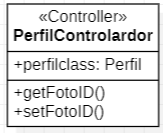

  

  <h1>Universidad Peruana de Ciencias Aplicadas</h1>
  
<strong>Carrera:</strong> Ingenieria de Software

  
<strong>Ciclo:</strong> 2025 - 1

  
<strong>Curso:</strong> Desarrollo de Soluciones IOT

  
<strong>Sección:</strong> 1ASI0572

  
<strong>Profesor:</strong> David Carlos Vera

  
<strong>"Informe de Trabajo Final"</strong>

  
<strong>Startup:</strong> xxx

  
<strong>Producto:</strong> xxx

<table align="center">
  <tr>
    <th>Integrantes</th>
    <th>Código</th>
  </tr>
  <tr>
    <td>Adrianzen Flores, Carlos Arturo</td>
    <td>U202215705</td>
  </tr>
  <tr>
    <td>Dam Rubianes, Frida Sofia</td>
    <td>U202218352</td>
  </tr>
  <tr>
    <td>Matos Fernandez, Christian Andre</td>
    <td>U202214162</td>
  </tr>
  <tr>
    <td>Ortiz Fajardo, Tomás</td>
    <td>U201910146</td>
  </tr>
  <tr>
    <td>Ramos Ramirez, Renzo Manuel</td>
    <td>U202113745</td>
  </tr>
</table>

<b>Abril 2025</b>

# Registro de Versiones

<table>
  <thead>
    <tr>
        <th>Versión</th>
        <th>Fecha</th>
        <th>Autor</th>
        <th>Descripción de modificación</th>
    </tr>
  </thead>
  <tbody>
    <tr>
      <td><strong>1.0</strong></td>
      <td>23 de abril de 2025</td>
      <td>
        <ul>
          <li></li>
        </ul>
      </td>
      <td>
        Creación del repositorio
      </td>
    </tr>
  </tbody>
</table>

# Project Report Collaboration Insights

# Tabla de Contenido

[Registro de Versiones](#registro-de-versiones)

[Project Report Collaboration Insights](#project-report-collaboration-insights)

[Tabla de contenidos](#tabla-de-contenidos)

[Student Outcome](#student-outcome)

[Capítulo I: Introducción](#capítulo-i-introducción)
- [1.1. Startup Profile](#11-startup-profile)
  - [1.1.1. Descripción de la Startup](#111-descripción-de-la-startup)
  - [1.1.2. Perfiles de integrantes del equipo](#112-perfiles-de-integrantes-del-equipo)
- [1.2. Solution Profile](#12-solution-profile)
  - [1.2.1. Antecedentes y problemática](#121-antecedentes-y-problemática)
  - [1.2.2. Lean UX Process](#122-lean-ux-process)
    - [1.2.2.1. Lean UX Problem Statements](#1221-lean-ux-problem-statements)
    - [1.2.2.2. Lean UX Assumptions](#1222-lean-ux-assumptions)
    - [1.2.2.3. Lean UX Hypothesis Statements](#1223-lean-ux-hypothesis-statements)
    - [1.2.2.4. Lean UX Canvas](#1224-lean-ux-canvas)
- [1.3. Segmentos objetivo](#13-segmentos-objetivo)

[Capítulo II: Requirements Elicitation & Analysis](#capítulo-ii-requirements-elicitation--analysis)
- [2.1. Competidores](#21-competidores)
  - [2.1.1. Análisis competitivo](#211-análisis-competitivo)
  - [2.1.2. Estrategias y tácticas frente a competidores](#212-estrategias-y-tácticas-frente-a-competidores)
- [2.2. Entrevistas](#22-entrevistas)
  - [2.2.1. Diseño de entrevistas](#221-diseño-de-entrevistas)
  - [2.2.2. Registro de entrevistas](#222-registro-de-entrevistas)
  - [2.2.3. Análisis de entrevistas](#223-análisis-de-entrevistas)
- [2.3. Needfinding](#23-needfinding)
  - [2.3.1. User Personas](#231-user-personas)
  - [2.3.2. User Task Matrix](#232-user-task-matrix)
  - [2.3.3. User Journey Mapping](#233-user-journey-mapping)
  - [2.3.4. Empathy Mapping](#234-empathy-mapping)
  - [2.3.5. As-is Scenario Mapping](#235-as-is-scenario-mapping)
- [2.4. Ubiquitous Language](#24-ubiquitous-language)

[Capítulo III: Requirements Specification](#capítulo-iii-requirements-specification)
- [3.1. To-Be Scenario Mapping](#31-to-be-scenario-mapping)
- [3.2. User Stories](#32-user-stories)
- [3.3. Impact Mapping](#33-impact-mapping)
- [3.4. Product Backlog](#34-product-backlog)

[Capítulo IV: Solution Software Design](#capítulo-iv-solution-software-design)
- [4.1. Strategic-Level Domain-Driven Design](#41-strategic-level-domain-driven-design)
  - [4.1.1. EventStorming](#411-eventstorming)
    - [4.1.1.1. Candidate Context Discovery](#4111-candidate-context-discovery)
    - [4.1.1.2. Domain Message Flows Modeling](#4112-domain-message-flows-modeling)
    - [4.1.1.3. Bounded Context Canvases](#4113-bounded-context-canvases)
  - [4.1.2. Context Mapping](#412-context-mapping)
  - [4.1.3. Software Architecture](#413-software-architecture)
    - [4.1.3.1. System Landscape Diagram](#4131-system-landscape-diagram)
    - [4.1.3.2. Context Level Diagrams](#4132-context-level-diagrams)
    - [4.1.3.3. Container Level Diagrams](#4133-container-level-diagrams)
    - [4.1.3.4. Deployment Diagrams](#4134-deployment-diagrams)
- [4.2. Tactical-Level Domain-Driven Design](#42-tactical-level-domain-driven-design)
  - [4.2.X. Bounded Context: &lt;Bounded Context Name&gt;](#42x-bounded-context)
    - [4.2.X.1. Domain Layer](#42x1-domain-layer)
    - [4.2.X.2. Interface Layer](#42x2-interface-layer)
    - [4.2.X.3. Application Layer](#42x3-application-layer)
    - [4.2.X.4. Infrastructure Layer](#42x4-infrastructure-layer)
    - [4.2.X.5. Component Level Diagrams](#42x5-component-level-diagrams)
    - [4.2.X.6. Code Level Diagrams](#42x6-code-level-diagrams)
      - [4.2.X.6.1. Class Diagrams](#42x61-class-diagrams)
      - [4.2.X.6.2. Database Design Diagram](#42x62-database-design-diagram)

# Student Outcome

ABET – EAC - Student Outcome 5: La capacidad de funcionar efectivamente en un
equipo cuyos miembros juntos proporcionan liderazgo, crean un entorno de
colaboración e inclusivo, establecen objetivos, planifican tareas y cumplen objetivos.

<table>
  <thead>
    <tr>
      <th>Criterio específico</th>
      <th>Acciones realizadas</th>
      <th>Conclusiones</th>
    </tr>
  </thead>
  <tbody>
    <tr>
      <td><strong>Trabaja en equipo para proporcionar liderazgo en forma conjunta</strong></td>
      <td>
        <strong>Renzo Manuel Ramos Ramirez</strong> <strong>TB1</strong>  
        <strong>Christian Andre Matos Fernandez</strong> <strong>TB1</strong>  
        <strong>Frida Sofia Dam Rubianes</strong> <strong>TB1</strong>  
        <strong>Carlos Arturo Adrianzen Flores</strong> <strong>TB1</strong>  
        <strong>Tomás Ortiz Fajardo</strong> <strong>TB1</strong> 
      </td>
      <td>…</td>
    </tr>
    <tr>
      <td><strong>Crea un entorno colaborativo e inclusivo, establece metas, planifica tareas y cumple objetivos</strong></td>
      <td>
        <strong>Renzo Manuel Ramos Ramirez</strong> <strong>TB1</strong>  
        <strong>Christian Andre Matos Fernandez</strong> <strong>TB1</strong>  
        <strong>Frida Sofia Dam Rubianes</strong> <strong>TB1</strong>  
        <strong>Carlos Arturo Adrianzen Flores</strong> <strong>TB1</strong>  
        <strong>Tomás Ortiz Fajardo</strong> <strong>TB1</strong> 
      </td>
      <td>…</td>
    </tr>
  </tbody>
</table>

# Capítulo I: Introducción
## 1.1. Startup Profile
### 1.1.1. Descripción de la Startup
### 1.1.2. Perfiles de integrantes del equipo
## 1.2. Solution Profile
### 1.2.1. Antecedentes y problemática
### 1.2.2. Lean UX Process
#### 1.2.2.1. Lean UX Problem Statements
#### 1.2.2.2. Lean UX Assumptions
#### 1.2.2.3. Lean UX Hypothesis Statements
#### 1.2.2.4. Lean UX Canvas
## 1.3. Segmentos objetivo

# Capítulo II: Requirements Elicitation & Analysis
## 2.1. Competidores
### 2.1.1. Análisis competitivo
### 2.1.2. Estrategias y tácticas frente a competidores
## 2.2. Entrevistas
### 2.2.1. Diseño de entrevistas
### 2.2.2. Registro de entrevistas
### 2.2.3. Análisis de entrevistas
## 2.3. Needfinding
### 2.3.1. User Personas
### 2.3.2. User Task Matrix
### 2.3.3. User Journey Mapping
### 2.3.4. Empathy Mapping
### 2.3.5. As-is Scenario Mapping
## 2.4. Ubiquitous Language

# Capítulo III: Requirements Specification
## 3.1. To-Be Scenario Mapping
## 3.2. User Stories
## 3.3. Impact Mapping
## 3.4. Product Backlog

# Capítulo IV: Solution Software Design

## 4.1. Strategic-Level Domain-Driven Design
### 4.1.1. EventStorming
#### 4.1.1.1. Candidate Context Discovery
#### 4.1.1.2. Domain Message Flows Modeling
#### 4.1.1.3. Bounded Context Canvases
### 4.1.2. Context Mapping
### 4.1.3. Software Architecture
#### 4.1.3.1. System Landscape Diagram
#### 4.1.3.2. Context Level Diagrams
#### 4.1.3.3. Container Level Diagrams
#### 4.1.3.4. Deployment Diagrams
## 4.2. Tactical-Level Domain-Driven Design

Se analizará el enfoque táctico del diseño de software aplicando los principios del Domain-Driven Design (DDD), tomando como base los bounded contexts que fueron establecidos con anterioridad.

### 4.2.1. Bounded Context: Perfíl

En el siguiente apartado, se expondrán las clases que han sido definidas para el Perfil Context, abordando las diversas capas que comprenden el dominio, la interfaz, la aplicación y la infraestructura. Además, se incluirán los diagramas de componentes y el código correspondiente para ofrecer una visión integral de la implementación.

#### 4.2.1.1. Domain Layer

Se identificaron los aggregates , root y value object para el bounded context de Perfil.

#### 4.2.1.2. Interface Layer

Especificamos el controlador para el bounded context de Perfil.

#### 4.2.1.3. Application Layer

#### 4.2.1.4. Infrastructure Layer

Aquí, gestionamos la persistencia de datos, la comunicación con servicios externos y la infraestructura subyacente que sostiene nuestra aplicación para el bounded context de Perfil.

#### 4.2.1.5. Component Level Diagrams

#### 4.2.1.6. Code Level Diagrams
##### 4.2.1.6.1. Class Diagrams

##### 4.2.1.6.2. Database Design Diagram

### 4.2.2. Bounded Context: Reconocimiento

En el siguiente apartado, se expondrán las clases que han sido definidas para el Reconocimiento Context, abordando las diversas capas que comprenden el dominio, la interfaz, la aplicación y la infraestructura. Además, se incluirán los diagramas de componentes y el código correspondiente para ofrecer una visión integral de la implementación.

#### 4.2.2.1. Domain Layer

Se identificaron los aggregates , root y value object para el bounded context de Perfiles.

#### 4.2.2.2. Interface Layer

Identificamos el controlador dentro del sistema encargado de operar y gestionar el bounded context de Reconocimiento Facial.

#### 4.2.2.3. Application Layer

#### 4.2.2.4. Infrastructure Layer

Aquí, gestionamos la persistencia de datos, la comunicación con servicios externos y la infraestructura subyacente que sostiene nuestra aplicación para el bounded context de Reconocimiento Facial.

#### 4.2.2.5. Component Level Diagrams

#### 4.2.2.6. Code Level Diagrams
##### 4.2.2.6.1. Class Diagrams

##### 4.2.2.6.2. Database Design Diagram

